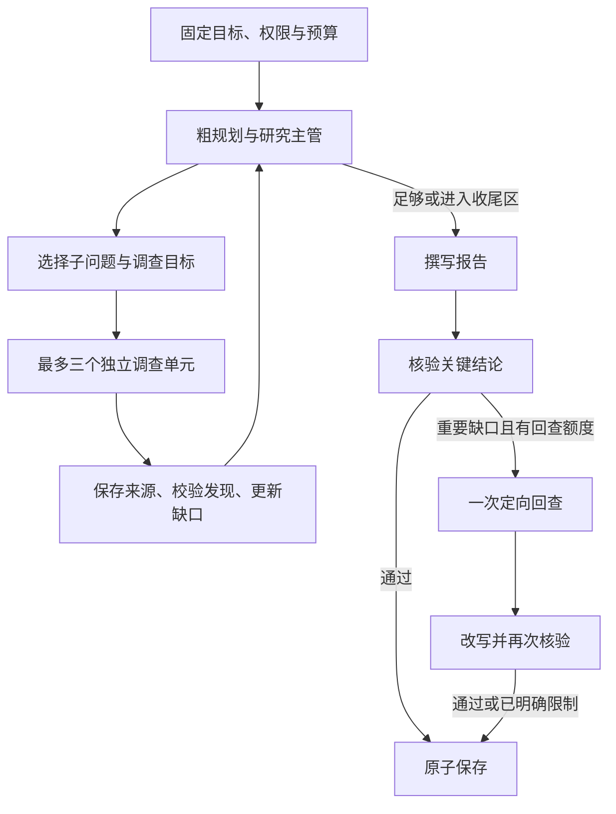

# 知乎深度研究开发方案

日期：2026-09-13 · 当前范围：只交付深度研究后端。设计已确定，产品实现和真实研究效果仍需验收。

运行架构按 [ADR-0006](architecture/decisions/0006-supervised-research-runtime.md) 直接实施，只做研究的产品范围继续按 [ADR-0005](architecture/decisions/0005-deep-research-mvp-scope.md)。不以架构 A/B 评测作为开发前置。本文规定研究行为与数据语义，[后端 API](backend-api.md)规定 HTTP，[实施任务](research/implementation-tasks.md)规定开发顺序，[开发提示词](research/implementation-prompt.md)可直接交给接手 Agent。先读项目规则与架构基线。用户指令和最新 ADR 优先；旧综合方案已移入[历史参考](research/deferred/README.md)，不得混用。

## 1. 唯一交付目标

用户输入一个问题，系统自动制定计划，分轮检索知乎，分析依据与分歧，按缺口补查，最终在本地保存可打开来源的研究报告。数据本地保存，模型可以调用云端 API。研究连续性由本地任务与 Mastra 工作流提供，不要求知乎接口支持多轮对话。

主路径：**提交问题 → 初步拆题 → 主管调度调查单元并持续重规划 → 成稿与核验 → 必要时定向回查并复验 → 保存报告**。没有固定总研究轮数，预算见第 7 节。用户目标固定，内部计划可演化，前端只读展示。前端未完成时可用 HTTP 独立完成整条链路。

| 当前必须交付 | 当前不开发 |
| --- | --- |
| 一个独立任务、顶层 Workflow、主管与受限调查单元 | 聊天、Memory、Space、用户画像、开放式 Agent 网络 |
| 知乎公开搜索；明确允许时全网补证 | 收藏、创作、知识库、OAuth、本地导入、旧报告再研究 |
| 真实来源、带证据的 Finding、动态计划与引用报告 | 全文爬虫、向量数据库、全量语料同步 |
| 创建、查看、取消、读取与 Markdown 导出 | 用户编辑计划、暂停继续、断点恢复、跨任务队列 |
| 请求去重、有限调用、超时、可靠保存 | SSE 重放、细粒度事件库、报告版本与编辑平台 |
| 本地 Node 后端和轮询协议 | Electron 接线、随包 Node、安装包、凭证桥、备份平台 |

不删除仓库已经存在的其他功能；本任务只新增研究链路所需内容。不得将后置能力变成研究的前置工程。

## 2. 已有基础与复用方式

2026-09-13 文档修订时，`package.json` 已声明 core 1.66.0、libsql 1.22.5、memory 1.29.0。当前这些依赖已按精确版本装入产品根目录，`src/contracts`、`src/application/deep-research.ts`、`src/agent`、`src/storage`、`src/backend` 与 HTTP 研究路由已按 ADR-0006 实现，并完成一次真实端到端研究；运行证据见[框架验证记录](research/framework-verification.md)。这不代表质量问题已经评估，也不代表未列出的后置能力可用。接手时重新检查 Git、源码与锁文件，尊重并行改动，复用已有事务与 adapter。

| 位置 | 研究开发需要做的事 |
| --- | --- |
| `src/platform/zhihu/client.ts` | 复用 HTTP 外壳与错误解析，贯通 AbortSignal、超时 |
| `src/platform/zhihu/content.ts` | 复用搜索；补齐真实元数据、稳定来源身份，不能使用数组下标作为 ID |
| `src/application/research-session.ts`、`research-brief.ts` | 现有内存会话和简报不能当作研究引擎；保持旧入口行为，新增独立研究命令 |
| `src/application/runtime.ts` | 可无外部凭证装配本地读取能力，研究执行再检查配置 |
| `src/server/http-server.ts` | 增加薄路由；不在 HTTP handler 中写研究循环或 SQL |
| `src/workbench`、`src/desktop` | 并行开发中的界面与桌面代码；本任务只交付接口，不重做它们 |

依赖固定为 Mastra core、官方 libsql adapter、Zod 与现有 Node HTTP。研究不启用 Memory，也不为此删除别人已加入的依赖。产品 SQLite 优先直接使用与 adapter 兼容的 `@libsql/client`，显式声明并锁定版本；已核对 adapter 1.22.5 依赖 `^0.18.0`。这样不必再引入第二套 SQLite native 驱动；产品事务仍需单独验证。

开发运行采用 Node 24 LTS，Mastra 要求至少 22.13.0；同步过低的 engines 声明并记录实际验证版本。框架、Agent.generate、循环和公开状态读取的依据见第 11 节，不凭记忆编造调用签名。

## 3. 知乎集成与证据约束

依据本地[公共内容 API](content-api.md)，实施时做少量真实抽样验证：

| 接口/字段 | 当前使用规则 |
| --- | --- |
| 知乎搜索 | GET `/api/v1/content/zhihu_search`，Query，Count ≤ 10；默认取 5 条；没有分页 |
| 全网搜索 | 仅 allowWebSupplement=true 时调用现有接口，Count ≤ 20、默认 5；用于官方事实补证，host 过滤不能指向知乎 |
| ContentText / Summary | 摘要，不是全文；来源统一标记 contentExtent=summary |
| ContentType + ContentID | 知乎实体身份；Int64 无损转十进制字符串，不能先经 JavaScript Number |
| URL | 保留完整原始 URL 用于打开和归属；另存 canonicalUrl 去重，不丢失原始溯源参数 |
| EditTime | 存 sourceTime，timeKind=published_or_updated；缺失为 null，不猜发表日期 |
| 作者/认证/互动 | 保存实际返回的昵称、认证、赞同与评论等；缺失为 null；不推断稳定作者 ID、身份真实性或代表性 |
| 精选评论 | 只作附属于该搜索结果的文字材料，不能编造评论作者、日期或完整评论树；首版报告引用主摘要 |

不补造正文读取、指定作者搜索、全部回答、完整评论或问题关联接口。官方契约尚未给出的参数不发送。全网搜索同样不能声称阅读全文；发布日期缺失时也保留未知。

每个任务独立保存证据快照。同一渠道的同一内容身份与相同文本哈希去重；内容改变则保存新快照，旧引用不被覆盖。知乎 identity 为规范化小写内容类型与 ID，全网 identity 使用规范化 URL，metadata 保留上游原始内容类型；缺少身份或可打开 URL 的结果不进入可引用证据，查询记录说明剔除数。相同内容的多个版本只算同一来源；不同昵称不证明作者独立。摘要中的高亮标记在 adapter 中按现有文本清理方式转为纯文本，再计算哈希与引用；不渲染上游 HTML。

知乎价值来自经验、条件、异议与反例的细读。高赞与排序分可用于阅读排序，不代表结论真实；搜索样本不代表“知乎用户普遍认为”。对最新政策、数字或许可证等问题，未允许全网补证且摘要不足时，应留下具体缺口。

## 4. 一条 Workflow 如何研究

### 4.1 运行形态与控制权

一个顶层 Workflow 承载准备、调查、写作、核验、定向回查与保存。调查阶段由一个 Research Supervisor 提出下一步，应用命令校验后派发最多三个 Research Unit，完成后合并证据并重新决策。单元使用独立上下文和 Mastra 官方 Agent 工具循环；可复用同一个 Researcher Agent 定义，不创建长期会话或递归 Agent 网络。

所有权：用户问题、来源授权与预算不可由模型更改；主管通过一个应用入口更新全局计划；单元只提交来源、发现和后续问题建议；代码拥有准入、预算、去重、取消、引用验证与提交规则。

### 4.2 初步拆题与持续重规划

主管首先产生 3–5 个主要子问题、必要假设与优先级，不预生成整项研究的全部查询。问题 ID 由应用生成，之后始终使用真实 ID。计划包含 version，修改后递增；初始数量不是整个任务的子问题上限。

每次主管看到：固定目标、当前子问题、近期单元结果、重要支持/反证/条件、未解决缺口和剩余额度。它可以新增问题、调整优先级、合并重复问题、解释为何关闭不相关或当前来源已饱和的问题，以及安排调查或建议成稿。已关闭问题保留身份和原因；不能删除历史证据关联，不能用关闭问题掩盖用户要求中的缺口。

计划只是有结构的子问题列表和引用关联，不建设通用 DAG 调度器。信息依赖通过“拿到结果后再创建后续调查”表达；同一个子问题同一时刻只分派一个单元。应用拒绝越权、重复或无进展决定，允许一次结构修正；修正仍无有效动作则结束探索并保留缺口，避免空调度循环持续消耗模型预算。

### 4.3 调查单元及知乎工具

每个单元接收 unitId、questionId、明确调查目标、相关已有 findings、允许来源和本地额度，使用官方工具循环完成小范围自主调查。可调用 searchZhihu、已授权时的 searchWeb，以及 readSource。readSource 只读取本任务已经保存的摘要及元数据，不宣称获取网页全文，不产生新的独立证据。

工具把 taskId、unitId、questionId 和身份绑定在可信运行上下文中，不让模型通过参数切换到其他任务。搜索工具转入应用命令：先原子准入与登记，再请求 API，再在事务内检查任务仍有效并保存来源。每次默认取 5 条；返回 sourceId、标题、有限摘要与来源语义，保留完整实际摘要在产品库。单元可基于发现继续搜索条件、反例、原始出处或核实某个说法，不要求每次先回主管。

单元输出结构化 findings 与后续建议。Finding 包含 id、unitId、questionId、statement、kind、conditions、limitations，以及 `{sourceId,quote,relation}` 证据数组；relation 为 support/oppose/qualify/context。id 由应用生成，quote 必须来自实际提供的来源文字。模型分析不升级为事实，来源指令不能改变权限。

来源按内容身份和文本哈希去重；相同查询在并行单元间也通过原子登记去重，已有已完成查询复用来源。相同查询正在执行时不再次发请求，可返回 QUERY_IN_PROGRESS 让单元读取已有材料或换方向。不同内容若明确转引同一个原始出处，应注明关联；没有出处证据时标为独立性未知，不靠昵称自动认定不同作者。首版不实现推测式来源聚类或 truth score。

单元到达本地步数、搜索额度或时间上限，可以提交已取得的部分发现。主管仍可为该问题创建带新目标的后续单元；单元额度不是整项研究的轮数上限。来源已保存但结构化结果无效时保留来源，记录单元失败，不把失败伪装成资料不存在。

### 4.4 合并、上下文和停止判断

单元不直接改全局计划。应用验证其证据与任务归属后，主管统一合并 findings、更新每个子问题的覆盖判断、条件、冲突与缺口。暂时过期的计划视图不使原始证据失效；相关性由当前主管判断，已关闭问题的迟到单元不重新开启计划。任务取消后的全部迟到写入拒绝。

产品保存不可变来源和带出处的 findings，后续压缩只改变模型视图。主管看相关摘要与缺口，调查单元看本问题资料，Writer/Verifier 按引用重新取证；不会反复摘要后丢掉原始材料。单次工具返回正文控制在约 6,000 字符，每个来源展示片段不超过 2,000 字符；需要时通过 readSource 取指定片段。全文缺失始终明确为 summary。

子问题覆盖继续使用 supported/partial/contested/unanswered。有依据的冲突不必被消除，但要解释适用条件。停止优先依据：关键问题已得到足够支持或限制说明；剩余问题经过不同适用策略后已无合理新方向；允许来源不可继续；进入全局收尾预算。不同策略包括背景、具体条件、反例和原出处查证。不是每题都机械执行所有策略，也不以固定连续两次查询/批次低收益终止整个任务。

只比较是否新增了相关依据、条件、反证或解决了缺口，不设计未经校准的复杂收益公式。并行批次只是执行方式，不存在“研究第八轮必须结束”的规则。

### 4.5 成稿、核验与一次定向回查

Writer 根据计划、finding 与真实摘要形成 conclusion/evidence/disagreements/gaps 四部分。段落输出 findingIds，应用从对应证据派生 sourceIds，链接由代码渲染；无依据的正文不能通过凑引用保存。

先做确定性引用检查，再由 Verifier 对关键结论及数字/日期核对来源，区分“材料这样说”与“事实已独立确认”。审阅只返回具体问题及证据需求，不能自行访问更多来源。

关键问题确实需要新证据且预算允许时，主管最多安排一次定向回查批次，范围仅限这些问题，不重新泛化研究。回查后改写并再次核验；不能省略修复后的检查。回查时间必须给最后一次改写与核验留出余量。无回查额度时删除/弱化不受支持的断言并说明缺口，再做必要检查；仍有严重引用问题或没有有效结论则失败，不保存事实性空报告。

报告与 task.outcome=completed 在同一产品事务提交，后续框架只收尾。报告保存一次且不可变；部分证据报告可 completed + partial，但不会把未核验草稿当成正式结果。

## 5. 模块边界与最小数据

复用已有同职责模块；下表是目标分工，不为匹配目录而搬家：

| 位置 | 职责 |
| --- | --- |
| `src/contracts/research.ts` | 共享 Zod：动态计划、Finding、分析、查询记录、预算、来源与报告 |
| `src/application/deep-research.ts` | 任务命令、研究决策准入、原子预算、计划提交、证据验证及保存 |
| `src/agent/research-workflow.ts` | 一个顶层 Workflow，官方循环/分支/foreach，并行单元返回小型引用结果 |
| `src/agent/research-agent.ts` | Supervisor、Researcher、Writer/Verifier 的提示和官方模型调用 |
| `src/agent/research-tools.ts` | 官方 createTool 适配 search/read，可信 task/unit 上下文，调用应用命令 |
| `src/storage/research-store.ts` | 产品事务与查询；不访问框架内部表 |

依赖由 runtime 组合，应用通过窄执行端口控制 Workflow；领域类型不导入 Mastra。使用一个 Researcher 定义创建隔离的调用上下文，不写跨 Agent 消息总线或通用调度服务。

| 产品表 | 内容与约束 |
| --- | --- |
| research_tasks | taskId、唯一 requestId、输入哈希、固定问题/来源许可、框架运行引用、outcome；plan、findings、analysis、queryLog、单元结果回执、usage、limits、modelInfo、error 用有类型 JSON；创建/结束时间 |
| research_sources | taskId 外键、sourceId、渠道、identity、textHash、不可变摘要及原始链接/作者/时间元数据；unique(taskId,channel,identity,textHash) |
| research_reports | taskId 唯一外键、reportId、四部分正文、finding/source 关联、完整度、停止原因及时间 |

plan 是唯一可变全局研究计划，findings 保存经过验证的发现及原始证据引用，analysis 保存按当前子问题合并的覆盖判断。主管通过一个命令串行写这些业务数据；单元完成时先保存其结果回执，主管随后合并，重复完成不会重复添加发现。单元结果回执嵌入任务，不单独建通用回执系统。

Mastra 保存阶段、活动单元和循环控制，产品不另存一份可调度的 active/pending 工作流状态。框架输入/输出仅携带 taskId、unitId、planVersion、result IDs 和控制结果；来源、完整模型输出和累计证据留在产品库，不放进每次 Workflow 快照。

产品 `product.sqlite` 与框架 `runtime.sqlite` 分开。产品目标 schema 为 v2，替换旧 round/固定计划语义；未发布数据不做兼容层，不兼容时明确失败，重置必须由显式命令执行。文件路径用标准 file URL，中文和空格按真实路径处理。

同一数据目录只有一个后端写入者，复用成熟目录锁。库事务不能跨网络/模型等待；并行写入使用短事务和同一应用入口，不用 UI 或多个 callback 各自改预算/终态。不引入图数据库、独立 EvidenceGraph 服务或十余张中间表。

## 6. 生命周期与一致性

**执行与研究内容分开。** Mastra 管步骤、单元与循环；子问题的覆盖度和计划优先级属于产品研究内容。产品 task.outcome 只记录 null / completed / failed / cancelled / interrupted，表示最终业务结果，并作为写入许可。task 不持久化可写的 stage/status；公共 status 是 outcome、当前活动执行与框架快照的只读投影。

- 创建：schema 校验后先查 requestId。同 key 相同规范化输入返回原任务，即使正在忙或凭证已移除；不同输入报 REQUEST_CONFLICT。新请求才检查配置和单任务准入，事务建立任务后启动 Workflow；受理与派发串行化，不占锁等待执行完成。
- 执行：单元可并行，主管更新计划与合并结果串行。每次外部请求前检查 outcome 仍为空并原子登记/预占预算；每次写来源、发现、分析或报告在事务内重新检查。框架/provider 自动重试默认关闭，不通过重跑单元解决保存失败。
- 完成：报告插入与 outcome=completed 一起提交；taskId 唯一约束避免重复报告。重复保存先返回已有结果，不能覆盖正文。产品提交后框架收尾失败只记脱敏诊断，不将成功任务改成失败。
- 取消：短事务将未结束任务设 cancelled 并关闭准入，然后触发 Workflow、模型和 HTTP 的 AbortSignal。活动执行尚未收尾时对外显示 cancelling，收尾后 cancelled；不能立刻腾出活动槽。已完成/失败/取消等终态的取消是幂等读取，不改终态。已保存来源保留。
- 竞争：取消事务先提交，则后到来源/报告拒绝写入；完成事务先提交，则取消返回 completed。不能在锁外判断后无条件写入。
- 重启：获得目录独占权后，outcome 为空的旧任务标记 interrupted。终态和已完成报告不变；不调用框架 resume/restart，不发送模型或知乎请求。需要再研究时显式新建任务，用新 requestId。
- 读取：未配置知乎或模型时仍能读本地任务、来源与报告。浏览页面关闭不取消；HTTP 查询不重新启动任务。

接入错误必须转成已保存的失败状态，不能让创建成功后的任务永远 starting。存储不可用时不伪造 failed/completed；返回 STORAGE_ERROR，停止新任务派发，下次成功打开库后按中断规则收敛。

## 7. 预算、超时与失败

预算保护时间和资源，不定义研究深度。采用下面一组可配置的初始默认值直接开发，不再以 A/B 决定架构。它们是工程取值，不是“理论最优调用次数”；创建任务时冻结完整快照。

| 限制 | 默认值 |
| --- | --- |
| 同时研究的顶层任务 | 1 |
| maxConcurrentUnits | 3 个独立调查单元 |
| maxConcurrentSearches | 4 个搜索请求，所有单元共享 |
| maxSearchRequests | 160 次准入尝试，知乎与明确允许的全网合并计算 |
| maxModelRequests | 200 次实际推理尝试，包含主管、单元工具循环中的每一步、结构修正、写作和核验 |
| timeoutMs | 2,700,000（45 分钟） |
| maxSources | 800 份有效快照，默认每次检索取 5 条 |
| synthesisModelReserve / synthesisTimeReserveMs | 12 次模型调用 / 600,000（10 分钟），进入保留区后停止一般调查 |
| unitMaxSteps / unitMaxSearchRequests / unitTimeoutMs | 12 个官方工具循环步骤 / 8 次搜索 / 300,000（5 分钟），均受全局剩余额度约束 |
| maxRepairPasses | 1 次定向回查批次；之后必须改写并复验 |
| 单次请求超时 | 搜索 20 秒，模型 90 秒，同时受单元与任务 deadline 限制 |

移除 maxRounds、maxQueriesPerRound 和 query.round。并发上限控制同时执行数量，单元上限防止一次上下文失控；主管可根据剩余缺口继续创建新单元。申请多个单元时先分配各自额度，不能给每个单元一份完整全局预算。

所有模型调用经过同一 adapter。Agent.generate 可能内部运行多次推理，不能算作一次 modelRequests；使用官方 prepareStep/onStepFinish 等接入准入与 usage，结构化输出可能产生的辅助推理也须覆盖。单元启动先预留可用额度，每步实际发送前登记消费，完成后只归还确定未使用的预留；结果未知的尝试不退还。模型、搜索并发都由同一产品预算入口原子处理，不能仅在所有并行请求结束后累计。

探索阶段 deadline 为总 deadline 减收尾预留；单次请求同时受它和自身超时限制。总搜索/来源额度耗尽后停止取新资料，尽可能利用已有证据成稿。达到总 deadline 或模型硬上限时不再发送任何请求，包括写作和核验；没有已完成正式报告就如实失败。不能把 hard stop 理解为“超额后还可以继续写”。

核验回查只能使用保留区剩余额度。应用在派发前同时为回查、最终改写、复验和保存预留资源；单次回查单元最长 3 分钟，并且结束后至少留出 4 分钟用于最后处理，时间不够就不派发。修复后仍有严重问题不能再开无限循环。

token usage 与费用如实记录，未知为 null。未配置模型价格时不虚构 dollar cost 或声称具备精确费用硬限，默认以请求数和时间保护；不为本期开发报价管理平台。日志记录调用角色与 unitId，区分搜索请求、工具动作、模型步骤与来源数量。

网络错误、空结果和资料不支持结论分别处理。一个单元失败不自动撤销其他单元的有效来源；主管可以换策略或把问题标为当前能力无法解决。鉴权/额度错误停止对应渠道，若所有允许渠道均不可继续则收尾或失败。取消立即关闭所有准入和产品写入许可，信号传递至全部活动单元与 HTTP 请求。

默认关闭 workflow、应用传输与 provider 的自动重试，保留最多一次明确的结构修正并计入预算。复用[额度接口](quota-api.md)排障，不把历史额度硬编码为平台真实可用额度。

## 8. HTTP 与后端运行

协议唯一入口为[后端 API](backend-api.md)，样例见[契约示例](research/contract-examples.md)。创建后返回 taskId，前端约每 1–2 秒轮询；终态停止轮询。stage 只表达 planning / researching / writing / reviewing / repairing / saving 或 null，不展示伪造的完成百分比或模型内部思维。

本地服务仅绑定回环地址，沿用现有服务约定。配置只来自后端环境/配置文件，模型 ID、provider 与密钥互相区分，密钥不写入任务/日志/提示词。仅接受 JSON 写请求，跨源访问限于明确开发 Origin，不打开任意 CORS；当前不新增登录与账号系统。

输入 question 去首尾空白后 1–2,000 字符，requestId 为 UUID，allowWebSupplement 默认 false，未知字段拒绝，请求体上限 16 KiB。来源文本只作为不可信资料，不授予访问文件、shell、其他账号或扩大范围的权力。

没有可用模型/知乎凭证时说明执行阻碍，先完成本地读取与 fixture 的机制验证；不能声称真实验收通过。框架 Studio 只作开发辅助，运行不依赖 Studio、全局 CLI 或远端工作流服务。

## 9. 验证与验收

架构已经确定，按[三个交付阶段](research/implementation-tasks.md)直接实施。多架构 A/B、预算曲线、三题以上真实 benchmark 都不作为首版前置，不把选择工作交回用户。

开发者完成受影响类型/后端构建和一条主链路核对；优先复用已有核心场景，只补预算并发、取消迟到写入、重复提交及引用归属必要边界。若没有真实服务配置，可用 fixture 核对机制，但必须明确真实效果未验证，不能用模拟声称正式研究完成。

当前交付看：主管可以根据证据增加问题；单元独立工具循环与并行均受全局预算约束；共享证据支持最终结论；核验能触发一次回查并复验；结果可靠保存。图数据库、通用调度平台或大量 helper 测试不属于完成条件。

[质量案例](research/quality-cases.md)保留为后续迭代资料。有人力时再研究调用规模与质量收益，不因此阻止按本架构开发。不要求当前用户投入测试或手动对照评测。

## 10. 将来何时扩展

只有实际需求出现才增加能力：研究普遍因摘要不足失败时优先确认官方正文/受控资料来源；用户频繁取消后希望继续时再设计恢复；重复主题需要跨任务资料复用时再建检索索引。先记录证据、调整 ADR，再实现。

聊天、账号、桌面接入、报告编辑等是独立产品任务；本方案完成无需交付它们。新的细节应服务研究正确性，不能借“可扩展性”恢复原来 13 项平台任务。

## 11. 依据与已验证边界

- 运行分工参考 [Open Deep Research](https://github.com/langchain-ai/open_deep_research)：主管协调受限调查单元、汇总发现并成稿；本项目用 Mastra 和 TypeScript 实现，不引入其 Python 运行时。
- 框架使用 [Workflows](https://mastra.ai/docs/workflows/overview)、[控制流](https://mastra.ai/docs/workflows/control-flow)、[结构化输出](https://mastra.ai/docs/agents/structured-output)、[Agent.generate](https://mastra.ai/reference/agents/generate)、[取消](https://mastra.ai/reference/workflows/run-methods/cancel)与[本地 libSQL](https://mastra.ai/integrations/databases/libsql)。
- [框架验证记录](research/framework-verification.md)：已在隔离环境验证文件持久化、取消、关闭重试及部分暂停/恢复原语。暂停/恢复只保留研究证据，不列入当前功能。
- 用户提供的探索报告作为思路参考（材料仅保存在本地，不纳入版本控制）；其中未验证的服务假设、价格与引用标记不作为本方案事实。
- 接口字段依据本仓库公共内容与额度文档；真实 API、模型质量、产品事务与后端运行由实施 Agent 如实记录，不能从依赖声明或本文推断已通过。

补充依据：已核对 [Anthropic Research 的主管/并行子 Agent 说明](https://www.anthropic.com/engineering/multi-agent-research-system)、[Open Deep Research 固定版本实现](https://github.com/langchain-ai/open_deep_research/blob/1b7d2e80db9faa586165c60e09096dbbfd483a64/src/open_deep_research/deep_researcher.py)与本地 Mastra 1.66.0 公开类型中的 foreach、循环、prepareStep 和 onStepFinish。API 存在不等于本产品集成已经完成。云端运行架构报告仅作研究参考（材料仅保存在本地，不纳入版本控制），其中失效引用或扩大首版范围的建议不作为开发命令。
