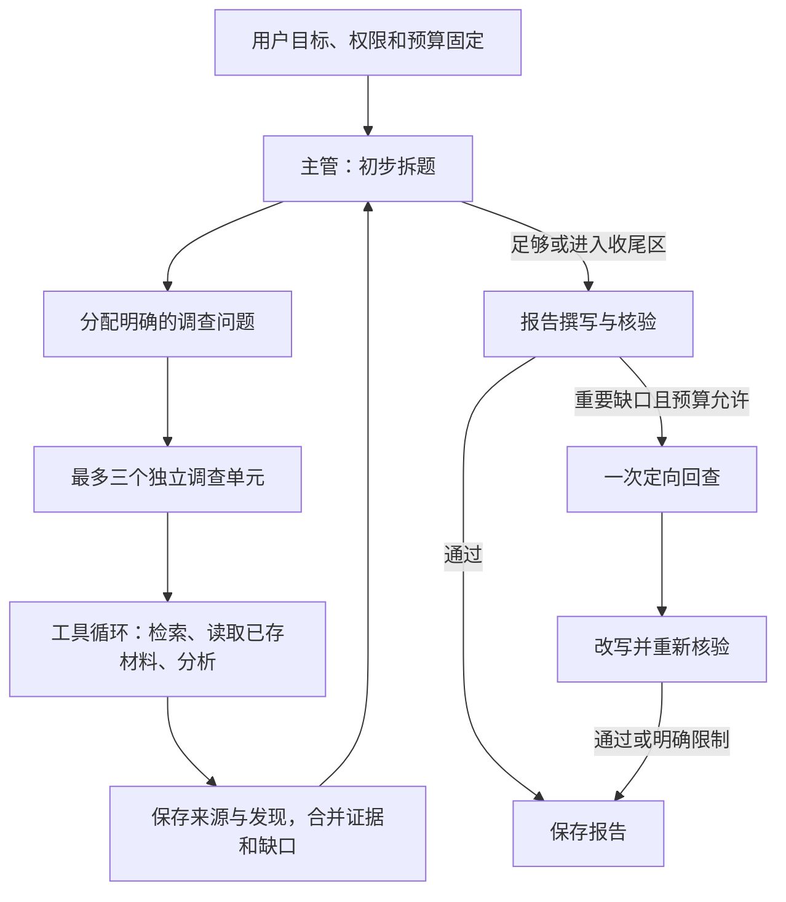

# 知乎深度研究运行流程

按 [ADR-0006](architecture/decisions/0006-supervised-research-runtime.md) 采用主管与受限调查单元。详细契约见[开发方案](deep-research-development-plan.md)与[API](backend-api.md)。

主管可以随着新证据新增子问题、调整优先级和关闭无价值方向；单元在自己的问题范围内自主取证，不修改全局计划。相关原始摘要、支持/反例/条件和调查记录共同构成研究状态，后续调用按需读取。

总研究没有固定轮数。并行数控制同时工作量，单元步数和局部额度防止一次上下文失控；全部单元共享全局预算。资料足够或多种适用策略已饱和时收尾，不机械地在两次低收益后结束整个任务。

引用检查从提取 Finding 开始，最终核验还要检查证据是否支持结论。回查只能发生一次，回查后必须复验。报告与成功结果一起保存；取消、错误、中断时保留有效资料，重启不自动重放请求。

方案直接实施。后续可以评估研究质量和调用效率，但不等待 A/B 决定运行架构，也不要求用户组织测试。
