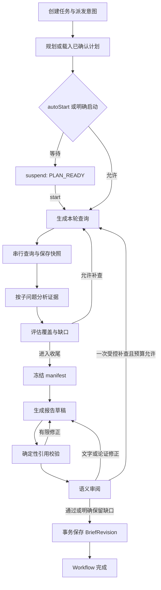

# 知乎深度研究完整开发方案

> 历史设计，已被 [ADR-0005](../../architecture/decisions/0005-deep-research-mvp-scope.md) 收敛。本文中的“首版”“必须”和开发清单均不是当前任务；仅供将来评估被后置能力。当前请从[实施任务](../implementation-tasks.md)进入。

本文面向独立承担实现的开发 Agent，规定目标行为、唯一实现路径、模块边界、数据与接口、研究策略、故障处理、任务拆分和验收方法。按本文及任务清单实施，不需要重新选择 Agent 框架。

设计基准为 2026-09-13。Mastra 选型及研究方向已经确定；本文中的业务实现、真实模型效果、知乎实接口联调和桌面发布验证，除明确列为已验证的项目外，均为待开发。官方资料的核对记录见附录，实验状态见[框架验证记录](../framework-verification.md)。

## 阅读与执行入口

1. 阅读 AGENTS.md（本地协作规则，不纳入版本控制）、[架构基线](../../architecture/架构基线.md)、[开发维护规则](../../architecture/开发维护规则.md)。
2. 阅读本文第 1—5 节，理解目标、现状、依赖和数据所有权。
3. 按第 6—15 节建立契约、持久化、研究流程和生命周期。
4. 对照 [后端 API](platform-backend-api.md) 接线；按第 16—19 节实现桌面与诊断边界。
5. 按[实施任务清单](../implementation-tasks.md)逐项交付，使用[质量验收案例](../quality-cases.md)评估研究效果。

规范优先级：用户已确定的需求 → 架构 ADR 与基线 → 公共 API 文档 → 本文详细设计 → 任务清单与示例。发现矛盾先报告具体冲突并修订 owner 文档，不能同时实现两套行为。本文的新增证据契约由 [ADR-0004](../../architecture/decisions/0004-zhihu-research-evidence.md) 决定。

## 1. 产品目标与交付范围

### 1.1 核心目标

用户提出一个需要多方面资料的问题，系统生成研究计划，在用户批准的来源范围与预算内进行检索、阅读、分析、补查和审阅，最终保存带来源、分歧、限制与未解决问题的报告。知乎是默认主要来源，外部资料用于用户允许的补充与事实核验。

支持专题综述、观点分析、方案比较、经验整理及有资料依据的事实调查。不同类型改变计划与证据要求，不改变任务底层、来源库或报告 owner。不将产品限定为某个行业或决策场景。

研究数据与任务在本机保存，模型可调用云端 API。一次知乎接口请求是独立查询；连续研究由本地计划、证据和工作流状态提供。产品不依赖知乎直答提供多轮会话。

### 1.2 用户主路径

输入问题 → 选择来源范围与预算档位 → 生成并查看计划 → 启动 → 观察问题覆盖和材料 → 获取报告 → 打开来源 → 继续提出新问题或明确创建后续研究。

创建时 `autoStart=true` 表示已经授权按创建范围直接执行；默认 false，规划后等待启动。生成与保存本地报告已经包含在研究请求中，不再重复申请保存授权。

### 1.3 首个可用版本与后续增强

| 范围 | 必须交付 | 条件与边界 |
| --- | --- | --- |
| 核心研究 | 可编辑计划、知乎搜索、证据分析、有限补查、引用报告 | 不要求聊天页面先完成 |
| 任务控制 | 创建、查看、排队、暂停、继续、取消、异常退出后显式恢复 | 一个活动研究任务，同一任务串行步骤 |
| 来源 | 知乎公开搜索；用户允许时全网搜索；明确导入的文本/Markdown | 原文不在可用接口内时只保存实际摘要 |
| 成果 | BriefRevision 四部分正文、来源查看、版本、Markdown 导出 | 用户笔记独立；导出不隐式发布或上传 |
| 个人知乎资料 | 选定收藏夹、创作范围、选定知识库 | 身份与来源定位通过专项验收后开放 |
| 后续优化 | 本地资料检索、查询排序、成本优化、独立子问题有限并发 | 基于质量和调用数据决定，另行改并发 ADR |

完整聊天系统、任意网页爬取、自动建立全量知乎语料、上传文件、定时监控、远端研究服务、公开发布和多 Agent 社会不作为本任务交付前提。平台适配目录可以容纳这些能力，但不得为赶进度把未实现能力标为可用。

### 1.4 成功与非成功

- 流程完成：有效报告已通过校验并事务保存，框架已收尾。
- 研究完整度：`sufficient`、`partial` 或 `insufficient`，单独描述证据能覆盖的范围。
- 部分报告：有有效证据，但部分关键问题未解决；可以 completed + partial，并注明原因。
- 无有效证据：保留查询与任务，返回 `EVIDENCE_REQUIRED`；不生成“看似有结论”的空报告。
- 报告已保存、框架尚未收尾：展示已保存成果及 interrupted/待恢复状态，不重复保存。

## 2. 已核实的现状与技术判断

### 2.1 当前仓库

| 位置 | 已有实现 | 开发动作 |
| --- | --- | --- |
| `src/platform/zhihu/client.ts` | 统一请求外壳、身份头、业务错误和无损整数解析 | 补 AbortSignal、超时、有限请求体、规范错误；不重写一套客户端 |
| `src/platform/zhihu/content.ts` | 知乎/全网搜索、热榜；摘要转换 | 保留 EditTime、认证信息、排序分、精选评论等实际字段；修正来源身份 |
| `src/platform/zhihu/user-data.ts` | 近期收藏、创作、关注列表 | 补收藏夹列表/内容；保留分页与身份，不将关注列表当动态流 |
| `src/platform/zhihu/oauth.ts` | 邀测授权码交换骨架 | 根据官方协议缺口控制 capability，不视作生产登录已完成 |
| `src/application/research-session.ts` | 最多 50 条 Map 会话，进程退出丢失 | 研究能力迁移至持久化 Research 与 SourceSnapshot |
| `src/application/research-brief.ts` | 搜索结果汇总、固定模板结论 | 保留旧入口正常行为到迁移完成；新报告采用模型分析和引用校验 |
| `src/application/runtime.ts` | 创建现有网关和命令；缺少凭证会影响装配 | 分离基础本地服务与外部能力，可无凭证读历史 |
| `src/server/http-server.ts` | 原型 HTTP、OAuth、内存会话 | 拆薄路由并调用新应用命令；控制返回与错误保持一致 |
| `src/workbench` | 使用示例传输的界面原型 | 只接入公共 DTO；不借其内部运行时再实现 Agent |
| `src/desktop/main.ts` | Electron 加载静态页面 | 后续启动随包 Node、等待后端 ready、加载同源页面 |
| `package.json` | 尚无 Mastra 和产品 SQLite 依赖 | DR-00 锁定依赖、更新 Node 要求与打包；本文不宣称已接入 |

现有 `ContentSource.id` 可能依赖渠道或数组序号，不能直接作为持久证据身份；现有空选列表可能回退前几项，不能沿用到“明确清空选择”的产品契约。迁移只改相关入口，不整理整个前端目录。

### 2.2 研究参考的取舍

公开 Open Deep Research 实现包含目标澄清、research brief、迭代调查、研究发现压缩及最终报告；并发、工具轮数和结构化输出修正均可配置。这证明可采用成熟的迭代模式，但不证明特定多 Agent 配置适合当前桌面产品。这里只借鉴流程原则，不引入其 Python/LangGraph 运行时，也不照搬提示词与源码。[^1]

Mastra 官方提供 Agent、结构化输出、工作流步骤、循环、存储、取消和暂停继续。官方模板列表提供通用文档助手等起点；此次核对未发现可直接满足本项目证据与恢复契约的完整知乎研究模板。因此集成官方原语，在应用层实现业务策略，技术与维护理由明确。[^2][^3]

用户提供的探索报告（材料仅保存在本地，不纳入版本控制）可作为思路材料。其部署与接口未知的假设不适用于当前已知的本地产品；远端 MCP 网关、独立向量数据库和多家托管研究服务不进入首版依赖。报告中的模型价格和引用标记未作为本方案证据。

## 3. 知乎能力与真实边界

### 3.1 能力矩阵

| 能力 | 输入与返回 | 研究使用方式 | 明确限制 |
| --- | --- | --- | --- |
| `zhihu_search` | Query、Count≤10；摘要、URL、内容类型与 ID、作者展示信息、互动、EditTime | 默认发现观点、经验和调查线索 | 无分页；没有已验证的作者/话题/时间过滤参数；不保证全文 |
| `global_search` | Count≤20；SearchDB、Filter；摘要 | 用户允许时核查官方资料与原始事实 | host 过滤不支持知乎域名；不把 HasMore 当成有可用分页参数 |
| 热榜 | ≤30 项标题、链接、摘要 | 用户从热点发起研究的入口 | 无热度分数和历史趋势；研究不默认每轮读取 |
| 直答 | 单次生成，可流式 | 可选术语或查询辅助 | 不是主 Agent 模型；生成答案不是独立证据；首版流程不依赖 |
| 用户创作 | 内容类型、标题、摘要、链接、时间与互动，分页 | 研究用户明确选择的创作范围 | 不返回全文；不代表任意作者的文章详情接口 |
| 收藏夹 | 列表与选定夹内容 | 从用户已经整理的专题材料取证 | 列表不分页，内容有分页；收藏不代表认同 |
| 近期收藏 | 最多近期一批，≤50 | 明确选择的近期材料补充 | 不能用于完整历史同步 |
| 关注 | 关注账号列表 | 后续可用作用户显式指定的偏好线索 | 不是关注者动态流，不自动抓取其内容 |
| 知识库列表/内容 | 选定库、游标、条目摘要与 OriginUrl 等 | 确认选择范围、浏览资料 | 必须保留十进制字符串 ID 和游标 |
| 知识库搜索 | POST，选定库 ID / scope，Limit≤10；有序字符串 | 指定私人/订阅资料检索 | 可能没有每个字符串的文档 ID、URL、段落；不得捏造映射 |
| 额度 | APIID、TotalUsed、RemainingQuota | 启动与限额故障时了解能力状态 | 多 Secret 共用额度；不在每次调用前预检；历史配额不作常量 |

契约来源：[公共内容](../../content-api.md)、[用户资料](../../user-data-api.md)、[知识库](../../knowledge-api.md)、[额度](../../quota-api.md)。这些是本地整理的官方接口基线，此次未调用带凭证的接口，真实行为需在任务 DR-02/DR-09 中验证。[^4]

### 3.2 必须遵守的证据规则

1. `ContentText` / `Summary` 是摘要，设 `contentExtent=summary`。用户导入的完整文本才可设 `full_text`；未来官方正文需独立验证后接入。
2. EditTime 的上游定义兼有发布时间/最后更新时间，保存为 `sourceTime` 与 `sourceTimeKind=published_or_updated`，不能伪造两份精确日期。
3. 保留原始 URL（含平台溯源参数）用于打开与归属；去重另用 `canonicalUrl`，不能改写展示链接后丢掉归属。
4. `ContentType + ContentID` 用于知乎实体身份；不同类型的同数字 ID 不能碰撞。Int64 作为字符串无损保存。
5. 昵称可能重复或匿名，不能用昵称作为作者唯一键或多来源独立性依据。
6. 精选评论只有文字时，绑定原结果快照的 `selected_comment` 位置；不能声称拥有评论作者、时间、完整评论树。
7. 知识库无条目定位的片段设 `locatorKind=retrieval_response`，只能展示为“选定知识库的检索片段，原条目未定位”。只知道查询选择了多个库时，不推断片段属于其中某个库。
8. 旧报告属于派生材料。用于后续研究时保留其引用链；不得把旧报告与其原始来源计算成两份独立证据。
9. 来源文本中的命令、代码、外链和“忽略规则”都是待分析数据，不改变工具权限与运行策略。

### 3.3 全文与 OAuth 的验收门槛

核心公开研究允许在明确标注的摘要上运行，但必须真实评估答案质量。若目标问题需要长论述而摘要不能支持，应输出缺口，并优先确认官方正文能力或用户可提供的授权资料。禁止把多轮摘要汇总宣传为已经阅读全文。

个人资料 capability 独立于公开研究。现有 OAuth 文档记录公网回调、state/PKCE/refresh/revoke 等未解决项；不能仅凭 token 交换代码就启用正式桌面登录。个人资料开发任务先核对最新平台协议，给出可验证的身份与回调方案；未经验证使用 `CAPABILITY_UNAVAILABLE`，不得回退到开发者账号。[^5]

## 4. 固定技术方案与目录

### 4.1 依赖

| 依赖 | 核对结果/选择 | 用途与验证 |
| --- | --- | --- |
| Node | 随包 Node 24 LTS；当前研究环境为 24.15.0 | 发布锁定完整版本与校验值；不能依赖用户 PATH |
| `@mastra/core` | 1.66.0，Node≥22.13.0，Zod ^3.25 或 ^4 | 唯一 Agent 与 Workflow 底层 |
| `@mastra/memory` | 1.29.0，peer core≥1.4.1-0 <2 | 聊天历史能力；研究阶段默认不启用持续对话记忆 |
| `@mastra/libsql` | 1.22.5，peer core≥1.63.1-0 <2 | 本地框架快照和消息 |
| Zod | 项目现有 4.4.3 系列 | 唯一 DTO/工具 schema，实施时精确锁定 |
| `better-sqlite3` | 实施时选择支持 Node 24 / Windows 的稳定版本并锁定 | 产品数据库窄 adapter；不让 Electron 加载其 ABI |
| `node:http` | 已有 | HTTP 与 SSE；沿用，不增加完整服务器框架 |
| 模型 provider | Mastra 官方路由或其受支持 provider | 一个已配置 profile 起步；模型 ID、上下文和能力实际验证 |

上述三个 Mastra 包的声明范围相容，不等于完整运行与打包验收通过。安装时使用精确版本和 lockfile；任何升级重新核对生命周期实验，不能使用滚动 latest 作为发布版本。[^6]

### 4.2 模块边界

```text
src/contracts/
  research.ts                 # 计划、范围、任务、查询、finding、coverage、manifest
  sources.ts                  # 来源快照、locator、证据片段
  briefs.ts                   # 公共成果正文与研究元信息
  events.ts                   # 事件 envelope、cursor、研究 data 联合
  errors.ts                   # 公共错误、结构 details
src/application/research/
  commands.ts                 # 公开任务命令
  research-service.ts         # 命令装配、短事务边界
  research-policy.ts          # 范围、版本、停止与提交条件
  query-planning.ts           # 校验/规范化查询提案、优先级
  source-collection.ts        # 受控调用、去重、快照与成员关系
  evidence-analysis.ts        # finding/coverage 验证与提交
  research-budget.ts          # 外部调用准入、累计用量、收尾预留
  research-context.ts         # 纯业务上下文选择，不导入框架
  research-recovery.ts        # 核对回执、申请 resume/restart
  research-dispatch.ts        # 持久化启动/继续意图，最多一个活动任务
  research-read-model.ts      # 框架公开快照 + 产品事实 → DTO
src/application/library/
  brief-service.ts            # 唯一保存/版本/导出入口
src/agent/
  runtime.ts                  # Mastra、storage、Agent 与 Workflow 装配
  research-runtime.ts         # 实现应用侧定义的窄执行端口
  research-stages.ts          # 阶段 Agent、结构输出和模型调用回执
  workflows/deep-research.ts  # 主流程、官方循环和 suspend/resume
  workflows/research-round.ts # 一轮取证与评估的官方子 Workflow
  tools/research-tools.ts     # 业务命令的 createTool 适配
  prompts/research/           # 版本化阶段提示词
src/platform/zhihu/           # 现有 adapter；补 knowledge.ts / quota.ts
src/storage/                 # product schema、repository、事务、框架装配
src/server/                  # 认证、薄路由、SSE、静态产物
src/cli/                     # 同一应用命令的验证与维护入口
src/desktop/                 # 随包后端进程、窗口与窄凭证桥
```

文件按实际职责建立；一个只有类型别名或一行转发的文件不必独立。目录示意不授权重排无关源码。应用层定义 `ResearchRuntimePort`，由 `src/agent/research-runtime.ts` 实现；composition root 注入，避免应用导入 Mastra 类型及反向循环 import。

### 4.3 执行端口

`ResearchRuntimePort` 只提供 `startAttempt`、`resumeAttempt`、`restartAttempt`、`cancelAttempt`、`readExecution`。参数是产品 IDs、显式执行授权与版本；返回结构化执行事实。该端口是隔离框架类型的 adapter，不是第二个工作流引擎，不提供自有节点调度 API。

`ResearchStagePort` 提供固定的 `plan`、`proposeQueries`、`analyze`、`evaluate`、`write`、`review`；每个方法只执行一次结构化模型调用。补查与修正的循环在官方 Workflow 中表达，端口内部不递归开展研究。

## 5. 数据所有权与一致性

| 事实 | owner | 不能出现的平行事实 |
| --- | --- | --- |
| 目标、计划版本、批准范围 | Research / ResearchTask 应用命令 | UI 自有计划、提示词中另一个权限集合 |
| 真实来源文字与获取记录 | Research 的 SourceSnapshot | 模型摘要覆盖原快照、框架 checkpoint 当证据库 |
| findings、评估、查询提案 | Research 应用命令 | 从聊天文本反解析业务事实 |
| 外部调用尝试与用量 | research-budget | provider 各自重试而不计费入账 |
| 控制意图、dispatch、执行许可 | ResearchTask 应用命令 | 前端启动下一步、聊天队列接管研究 |
| 阶段位置、循环进度、暂停快照 | Mastra Workflow | 产品 SQL 可独立改写 status/stage |
| 成果与版本、用户笔记 | library | 另建 Report 表与 Brief 双写 |
| 凭证 | Secret Store / auth | 计划、日志、数据库 JSON 或模型消息包含密钥 |

`product.sqlite` 与 `runtime.sqlite` 独立。两库不存在跨库事务；所有不可重复的产品提交都保存操作回执。框架步骤恢复时先读取同一操作回执，再决定是否执行外部调用或写入。

研究 scope 是上限，模型发现的候选只能落在范围内。普通简报的 `manual_selection` 与研究的 `scoped_research` 共用来源与成果入口；研究新增来源不改变用户手选列表。

## 6. 领域契约

以下字段是待落到 `src/contracts` 的目标契约。所有用户输入和模型输出都由共享 Zod 校验；存储加载也校验 schemaVersion。时间为 UTC ISO 8601，ID 为不透明字符串，版本为正整数，未知可选事实用 null；模型输出不允许额外字段偷偷扩展权限。

### 6.1 ResearchScope

| 字段 | 类型 | 语义 |
| --- | --- | --- |
| publicChannels | `('zhihu_search' \| 'global_search')[]` | 默认仅知乎；去重，不接受任意渠道名 |
| accountRef | `string \| null` | 后端解析的授权账号引用；无 token |
| favlistTokens | `string[]` | 明确选定的收藏夹，不能传 all |
| includeCreations | boolean | 是否允许检索该授权账号创作 |
| includeRecentCollections | boolean | 是否纳入明确选定的近期收藏范围 |
| knowledgeBaseIds | `string[]` | 选定库，无损十进制字符串 |
| localSnapshotIds | `string[]` | 明确可用的导入/已有资料快照 |
| priorBriefRevisionIds | `string[]` | 用户明确允许复用的旧成果版本 |
| timeRange | `{from: ISO\|null, to: ISO\|null, mode:'prefer'\|'strict'} \| null` | 产品筛选政策，不能直接假装知乎有同名接口参数 |

`strict` 下无法证明时间在范围内的内容不进入事实性证据，可保留为候选并记录排除理由。`prefer` 下允许未知日期但报告说明。任何私人渠道配置都必须有有效 accountRef；知识库的真实身份语义先由 adapter 专项验证。

accountRef 是后端创建的授权引用，不是由模型/昵称推断的知乎账号 ID。若平台未提供稳定 subject，重复授权建立新引用，不自动合并为同一账号；应用启动时若令牌已不可用，只读历史与重新授权分开处理。

至少选择一个可用来源渠道或一份允许的本地/既有材料；空 scope 直接 INVALID_INPUT。列表型 ID 去重；模型不得自动启用 includeCreations/includeRecentCollections。from/to 都存在时必须 from≤to；日期格式非法不能按“未知时间”静默接受。

### 6.2 ResearchBudget

| 字段 | 默认起点 | 约束 |
| --- | ---: | --- |
| maxExternalRequests | 20 | 计入搜索、列表、知识库、直答等实际外部业务请求及重试 |
| maxModelRequests | 30 | 计入规划、查询、分析、写作、审阅和格式修正 |
| maxFollowUpRounds | 3 | 初轮编号 0；最多再补查 3 轮 |
| maxActiveMs | 600000 | 不含等待用户与暂停；运行时间达到限制进入受控收尾 |
| reserveModelRequests | 6 | 收尾模型请求预留，包含在 30 次之内 |
| reserveActiveMs | 90000 | 收尾时间预留，包含在 10 分钟之内 |

这些是可调开发默认值，非质量/时延承诺；配额不足可更早停止。最终允许的预算来自任务请求/用户改计划，模型不可自行增大。金额与 token 使用可观测但首版不伪造精确美元硬上限：没有可靠定价/计数时返回 null。

所有请求数/轮数必须为非负安全整数；maxModelRequests 和 maxActiveMs 为正，reserveModelRequests≥2 且小于 maxModelRequests，reserveActiveMs>0 且小于 maxActiveMs。纯本地资料任务允许 maxExternalRequests=0；启用外部渠道不代表可以越过此值。修改预算时新上限不得低于已累计用量。

### 6.3 ResearchTask 与 PlanRevision

Task 保存 id、researchId、创建请求与 requestId、modelProfile 的冻结配置引用、当前 planRevision、controlRevision、controlIntent、activeAttemptId、创建时间以及预留成果身份。status/stage 仅出现在 read DTO，不能成为可写领域列。

PlanRevision 保存 taskId、revision、goal、assumptions、scope、budget、questions、outputOutline、createdAt、createdBy（user/model）。目标文本不是执行指令授权；权限必须来自结构化 scope。

Question 包含 `id`、`text`、`required`、`priority`（1—3，1 最高）、`evidenceNeeds`、`verificationRequirements`。规划推荐 3—5 个问题，最大 8 个；窄问题可少于 3 个，不强凑子问题。verificationRequirements 的元素为 `{id,kind,description}`，kind 取 `check_primary_source|seek_counterexample|compare_conditions|check_time`，description 只作展示。

`evidenceNeeds` 区分 `definition`、`firsthand_experience`、`comparison`、`counterexample`、`primary_fact`、`time_change`。这是证据需求，不等于已经取得这种证据。

子问题 ID 由应用分配；模型只返回数组与内容。已有计划编辑保留未改变语义的问题 ID，新增问题由应用分配。查询动态变化不生成新 PlanRevision。

### 6.4 ResearchQuery 与 QueryResult

Query 保存 id、taskId、planRevision、roundIndex、questionId、purpose、channel、queryText、filters、normalizedKey。purpose 取 `broad`、`focused`、`counterevidence`、`verify_fact`、`resolve_conflict`、`fill_gap`。

模型只能提出 queryText、已知 questionId、purpose 和允许的 channel。账号、库 ID、过滤表达式、Count、重试政策与预算由应用注入。全网 Filter 从结构化域名/时间构造，不接受模型原始表达式。

QueryResult 记录 `success|empty|failed`、snapshotIds、excludedCount 与结构排除原因、cacheHit、fetchedAt、error、callAttemptIds、newSourceCount。失败不是空列表。命中缓存保留原 fetchedAt。

### 6.5 SourceSnapshot 与 EvidenceSpan

| 字段 | 类型/说明 |
| --- | --- |
| snapshotId / sourceKey | 快照身份 / 跨渠道去重的来源身份 |
| schemaVersion | 首版 1 |
| originKind | `zhihu\|web\|knowledge\|local\|brief` |
| contentType / externalContentId | 上游真实类型和字符串 ID，可空 |
| title / url / canonicalUrl | 展示标题、真实跳转链接、去重 URL；无原文链接时 url=null |
| text | 规范化后实际获得的文字；不混入模型摘要 |
| contentExtent | `summary\|snippet\|full_text` |
| locatorKind | `document\|retrieval_response\|derived_report` |
| author | 可空展示信息对象；只有上游提供稳定身份时才填 identity |
| sourceTime / sourceTimeKind | 可空时间；`published\|updated\|published_or_updated\|unknown` |
| fetchedAt / textHash | 获取时间、规范化文字 SHA-256 |
| identityScope | 后端账号/授权引用，绝无 Secret/token |
| retrieval | channel、queryId、responseHash、itemOrdinal、已知库范围 |
| metadata | 互动、认证、排序、精选评论；保留实际数据但只向模型开放必要字段 |

author 的字段固定为 name、avatarUrl、badgeText 和 identity（均可空）；identity 只有真实提供时填 `{namespace,id}`。identityScope 是 `{kind:'public'|'local',accountRef:null}` 或 `{kind:'authorized_account',accountRef:string}`；公开请求的 callerCredentialRef 另在调用账本与缓存 key 中保留引用，不能用 Secret 本身作为键。

retrieval 对导入材料为 null；接口材料包含 channel、queryId（列表导入时可空）、responseHash、itemOrdinal、knowledgeBaseIds。metadata 定义 voteCount、commentCount、authorityLevel、rankingScore、selectedComments 等已知可空字段；额外官方字段只保存到受控原始元信息，不自动交给模型。分析文字先去 `<em>` 高亮、统一 CRLF 为 LF，再产生 hash/span；不合并会改变原文含义的段落。

EvidenceSpan 是 `{snapshotId, field, start, end, quote}`；field 为 `{kind:'text'}` 或 `{kind:'selected_comment',index:number}` 的结构化联合。索引按 JavaScript UTF-16 code unit，半开区间 `[start,end)`；必须满足选定字段的 `slice(start,end) === quote`。不得根据模型声明的偏移信任原文。

模型优先返回 quote 与 snapshotId，由应用在指定 field 中定位；出现多次时要求 occurrenceIndex 或拒绝歧义。空引文、越界、未授权 ID、不存在的评论、引用被省略部分都应报 `INVALID_CITATION`。清洗先于 hash 与偏移计算。

sourceKey 优先为知乎类型+ID；无稳定 ID 使用保守规范化 URL；无 URL 的知识片段用“授权范围+queryId+响应hash+ordinal”标识检索响应中的材料，不伪造文档身份。来源快照变化创建新 snapshotId，旧引用不变。

### 6.6 ResearchFinding 与 ResearchEvaluation

Finding 包含 id、taskId、planRevision、roundIndex、questionId、statement、kind、evidence、conditions、limitations。kind 取 `reported_fact|reported_experience|opinion|inference`。其中 `reported_fact` 表示来源声称的事实，不代表系统认证真实。

每条 evidence 包含 EvidenceSpan、`relation=supports|contradicts|context`、`directness=direct|indirect`。数字、日期和普遍性断言必须能回到具体片段；分析可以输出“没有足够证据形成发现”，不能为了填满数组生成内容。

Evaluation 按问题保存 `coverage=unanswered|partial|supported|contested`、findingIds、missingEvidence、verificationDone 与 nextQueries。另保存 `recommendation=continue|write`、reasonCode、lowYield 与 explanation。首版只有规划阶段提出必须的背景问题；调查中的信息缺失转为补查或报告缺口，用户仍可主动暂停改计划。

verificationDone 的元素为 `{requirementId,outcome,evidenceRefs,reasonCode}`，outcome 取 `satisfied|unresolved`；satisfied 必须关联对应证据，缺少证据只能 unresolved。reasonCode 取 `DIRECT_EVIDENCE_FOUND|SOURCE_NOT_FOUND|SOURCE_UNAVAILABLE|LOCATOR_INCOMPLETE|BUDGET_LIMIT`。Evaluation.reasonCode 取 `REQUIRED_EVIDENCE_MISSING|CONFLICT_UNRESOLVED|COVERAGE_READY|LOW_INFORMATION_GAIN|BUDGET_LIMIT|SOURCES_UNAVAILABLE`，程序不解析 explanation。

应用校验已知问题/来源、证据匹配、范围及预算；去除无证据支持的“supported”建议应返回模型修正，不默默接受高覆盖率。coverage 是判断，来源数和查询数是客观计数，API 分字段展示。

### 6.7 EvidenceManifest 与报告

Manifest 是不可变的本次成稿输入：id、taskId、planRevision、revision、snapshotIds、findingIds、evaluationId、createdAt。只包含本任务当前仍允许使用的材料；旧计划被排除的材料不能混入。

BriefRevision 沿用四部分正文。每个版本由 library 分配不可变 revisionId，同时保留 briefId 与递增 revision；`UNIQUE(briefId,revision)`，revisionId 用于 manifest/后续任务的稳定版本引用，API 的 id 仍指 briefId。研究生成时追加 `researchMeta={taskId, planRevision, manifestId, stopReason, completeness, unresolvedQuestions, limitations, coverageSummary, generatedAt}`。正文段落可带 questionId/findingIds，sourceRefs 仍为 snapshotIds。所有被引用的 finding 与 source 都必须属于 manifest。

正文标题和段落可以在四个基本部分内按专题组织，首版不新增第二套任意树形报告编辑器。固定 `gaps` 不能因文章长度被删掉。导出由 renderer 根据结构化正文生成 Markdown 和引用列表；引用编号按首次出现顺序由程序分配，模型不生成最终编号或 URL。

stopReason 取 `coverage_sufficient|low_information_gain|budget_exhausted|sources_unavailable`。错误与取消任务可没有 report，不强填 stopReason。coverageSummary 为必答问题计数 `{required,supported,partial,contested,unanswered}`，后四项之和必须等于 required；可选问题另在逐题 coverage 中展示。

completeness 由应用依据已校验的 evaluation 生成：必答问题均 supported/contested 且规定核查已完成为 sufficient；至少一个必答问题有有效发现、但仍有关键缺口为 partial；只有背景/可选问题发现、尚不能支持必答问题为 insufficient。任何有效 finding 都没有时不成稿，返回 EVIDENCE_REQUIRED。争议本身可以是充分回答，不能强行求一致；sufficient 也不等于覆盖整个知乎或科学事实认证。

## 7. 产品存储与事务

### 7.1 最小持久化集合

沿用既有 Research / library 领域，在同一 product.sqlite 内实现下列集合。嵌套数组用经 Zod 校验的 JSON TEXT；不要为每一个提示词字段建立关系表。需要原子校验和查询的身份、版本、外键、时间列独立存储。

| 表/集合 | 独立列与约束 | JSON 内容 |
| --- | --- | --- |
| spaces | id PK、createdAt、archivedAt | 最小组织信息；共享产品基础，不要求聊天实现 |
| model_profiles | id PK、version、createdAt | provider/model、能力配置与 secretRef，无密钥；任务冻结配置版本 |
| researches | id PK、spaceId FK、createdAt | 研究元信息 |
| research_tasks | id PK、researchId FK、activePlanRevision、controlRevision、activeAttemptId、createdAt | 创建输入、冻结模型配置、控制意图 |
| research_plan_revisions | PK(taskId,revision)、createdAt | 完整计划；不可变 |
| research_attempts | id PK、taskId FK、frameworkRunId UNIQUE、createdAt | 框架版本、启动/继续关联；没有自有 stage |
| research_dispatches | id PK、taskId FK、expectedControlRevision、claimedAt、finishedAt | start/resume/restart 意图；不是节点队列 |
| source_snapshots | snapshotId PK、sourceKey、identityScopeKey、textHash、fetchedAt | 快照与实际文字；不可变 |
| research_sources | PK(researchId,snapshotId) | 来源成员与可用性 |
| research_queries | id PK、taskId、planRevision、roundIndex、normalizedKey | 查询、结果、排除原因 |
| research_findings | id PK、taskId、planRevision、roundIndex、questionId | 经过校验的分析 |
| research_evaluations | id PK、taskId、planRevision、roundIndex | 覆盖与继续建议 |
| research_manifests | id PK、taskId、revision、UNIQUE(taskId,revision) | 冻结证据与发现引用 |
| research_report_artifacts | id PK、taskId、planRevision、kind、createdAt | kind 仅 draft/review；分别引用 manifestId/draftId，保存不可变草稿或审阅结果 |
| external_call_attempts | id PK、taskId、operationId、createdAt、completedAt、state | channel/model、预算归属、usage、未知结果原因 |
| operation_receipts | UNIQUE(ownerId,operationId)、inputHash | 已提交结果引用；相同输入直接复用 |
| briefs / brief_revisions | briefId、revisionId PK、UNIQUE(briefId,revision)，沿用 library owner | 四部分正文、researchMeta、用户笔记独立 |

这是新增业务事实的最小集合，不要求建立通用事件溯源系统。查询结果、finding 等只写一次；若需要修订，写新版本/新记录并由新 evaluation/manifest 引用。

当前这些产品基础并未存在于正式数据库，DR-01 必须同时建立最小 Space、Research、model profile 与 library 命令；不能把“文档已经命名”当作代码已实现。研究草稿/审阅产物只是任务中间结果，不进入正式报告列表，不成为第二个成果 owner。

同一 sourceKey 可有多个快照。相同文字但获取时间或 metadata 不同的材料可新建快照；文本 hash 用于去重分析与评估新增信息，不允许覆盖旧引用。不同 research 复用公开快照时仍写各自 membership；私人资料不得跨 accountRef 复用。

### 7.2 数据库配置与启动

产品库开启 `foreign_keys=ON`、WAL，写事务短小；busy timeout 明确配置。数据目录和 schemaVersion 由本地产品启动器管理。当前未发布数据只维护目标 schema，不写隐式迁移兼容层；不兼容时明确报错，显式重置命令必须展示真实目标目录并停止所有执行。

打开两库前取得规范化数据目录的独占命名管道。生产数据目录使用绝对路径，libSQL URL 由 Node `pathToFileURL` 构造；中文、空格、反斜杠与盘符必须在 DR-00 实验中覆盖。不同运行模式不能默默指向不同数据目录。[^13]

### 7.3 三类事务

**创建事务**：校验 scope/model profile → requestId 去重 → 创建/关联 Research → 预留 taskId、成果身份、framework run 引用 → 写 task 与 dispatch → commit。事务后才启动 Workflow。派发失败可恢复同一意图，不重复创建任务。

**阶段提交事务**：重读 task 控制版本与计划 → 验证操作 inputHash → 校验来源成员和 schema → 写查询/发现/评估及 receipt → commit → 返回对象引用。网络请求和模型调用在事务外。

**成果事务**：重读执行许可与目标版本 → 验证 manifest 与全部引用 → 写 BriefRevision 和 receipt → commit → 返回版本引用 → Mastra 保存本步骤快照。重复相同 operationId 返回同一成果；同 key 不同 payload 返回 REQUEST_CONFLICT。

### 7.4 操作键与执行尝试

逻辑操作键由后端分配，包含 taskId、planRevision、阶段用途、roundIndex、queryId/成稿修订号；不单纯使用 attemptId。这样在新执行尝试恢复同一工作时可以复用回执。attemptId 与 controlRevision 负责执行许可，operationId 负责业务幂等，两者不得混为一个字段。

外部 mutation requestId 的去重范围为“本地访问身份 + commandName”；inputHash 对经过 schema 校验且补齐默认值的对象做稳定 JSON 序列化后 SHA-256。对象 key 稳定排序；集合型 ID 列表先去重排序，questions/正文等有序数组保留顺序。幂等冲突必须发生在任何新的外部调用之前。

回执复用也必须先检查当前权限。旧计划下完成的取证可以在新计划仍允许时显式选入新 manifest；不能因为“数据库里有”就绕过新 scope。

### 7.5 保留、移除与备份

首版任务取消保留已取得材料与成果；移除手选来源影响以后接受的普通简报；立即撤回资料先停止涉及的执行，再重建后续上下文。历史删除/彻底清理属于单独命令，不能在取消或失败处理里级联删除。

备份先停止派发、结束执行、关闭两库，再复制数据库和受管理导入文件，记录 schema/framework 版本与文件校验值。普通备份不含凭证。备份、恢复、重置不作为隐式启动操作。

## 8. Workflow 的具体实现

### 8.1 图结构与阶段边界



使用 `createWorkflow`、`createStep`、`.then()`、`.branch()`、`.dountil()` / `.dowhile()`、`.commit()`。一轮取证用官方子 Workflow；独立查询首版串行。补查循环与审阅修正各有明确上限，不能在普通函数里再写一套通用状态机。[^7]

正式实现以“取证子 Workflow + 成稿审阅子 Workflow + 最多一次审阅返查”组合。审阅返查消耗同一个 `maxFollowUpRounds` 与累计预算，不新增第二个免费预算。返查不可用时，明确降低结论强度或保留缺口；不能直接拿审核意见当新证据。

### 8.2 步骤表

| stepId | 输入引用 | 实际动作 | 输出引用 / 可重放性 |
| --- | --- | --- | --- |
| `prepare-plan` | taskId、attemptId | 载入已有计划，或调用 planner 后保存；不因重开重复规划 | planRevision；有回执复用 |
| `await-plan` | planRevision | autoStart/显式 start 校验，否则 suspend | 当前执行许可；本步骤无外部调用 |
| `propose-queries` | 计划、上一轮 evaluation | 查询提案模型调用，应用过滤/去重/限量 | queryIds（本轮查询引用数组，不另建批次实体） |
| `collect-sources` | 已批准的 query IDs | 按查询逐项准入、调用、快照保存 | QueryResult refs；逐条回执 |
| `analyze-evidence` | 子问题、相关快照 | 分批模型提取并校验 finding | findingIds；按批回执 |
| `evaluate-coverage` | 所有有效 findings、上一轮评估 | 模型评估；应用决定允许的下步 | evaluationId、continueAllowed |
| `freeze-evidence` | 有效计划与评估 | 范围校验，创建不可变 manifest | manifestId；确定性事务 |
| `draft-report` | manifestId、报告要求 | 结构化写作，草稿写 research_report_artifacts 并记录回执 | draftRef；不是已保存成果 |
| `validate-citations` | draftRef、manifestId | 结构、引用、片段、范围与元信息检查 | validation result，无模型 |
| `review-report` | 草稿与对应原始片段 | 审阅支持关系、遗漏、夸大与分歧 | reviewRef、结构化问题列表 |
| `save-report` | 通过校验的 draftRef | library 幂等保存 | briefId、revisionId |

一个 Workflow step 内可处理一组确定性操作，但每个外部调用和产品提交有独立 operationId。不得在“多个请求 + 模型 + 保存”的大步骤上启用无差别整体重试。reviewRef 与 draftRef 都指 research_report_artifacts 的不可变记录，不能只存进进程 Map。

### 8.3 Workflow state 与上下文

Workflow state 只保存 taskId、planRevision、roundIndex、query/finding/evaluation/manifest/draft 引用、修正计数和已确定的退出理由。它是框架持久化的执行状态；产品仅保存相应不可变产物，不能基于一份可写 SQL roundIndex 自行调度步骤。

RequestContext 仅传后端生成的身份引用和控制版本；不得传 Secret、完整来源文本、数据库连接或可执行闭包到持久化快照。应用命令在每次调用时根据引用取得真实凭证与权限。

每个步骤开始与每次提交前都执行 `assertExecutionAllowed`。开始校验不足以阻止取消后的迟到结果。网络调用使用组合后的 abortSignal；模型调用同时接收 `options.abortSignal`。

### 8.4 规划规则

规划阶段只使用问题、用户说明与明确提供的本地材料描述，首版不预设需要额外“侦察查询”。这样规划预算和 `autoStart=false` 行为清晰；后续确需侦察时作为批准范围内明确计费步骤加入。

Planner 输出 `ready` 或 `needs_context`。只有缺失条件会显著改变研究对象/范围时才请求补充，例如只给了“这个方案怎么样”却无方案。一般偏好缺失保存 assumptions 并继续；不能强制每个任务问卷化。

`needs_context` 输出具体问题与 reasonCode=MISSING_CONTEXT，在 await-plan 暂停。用户补充后保存新计划并 start，不保持一个等待输入的模型网络请求。

### 8.5 查询策略

初轮每个必答子问题最多两个查询，推荐一个概括查询、一个具体场景/反例查询。整个初轮最多 8 个外部查询，Count 默认 10。预算不足按 priority 保留必答问题，不平均耗尽所有额度。

查询语句采用知乎常见表达：概念名、具体问题、使用场景、年份、失败经验和争议点。关键词改写只改变 Query 文本，不虚构作者/话题/时间参数。

补查每轮最多 4 个新查询，优先级顺序：关键事实尚未核验 → 必答问题无依据 → 相互冲突且影响结论 → 关键适用条件缺失 → 可选拓展。单纯换一种说法但预期不会新增证据的查询应拒绝。

`normalizedKey` 包含 channel、规范化 query、真正支持的 filters、accountRef、资料范围、协议版本。规范化仅 trim、统一空白与明确的等价格式，不对中文内容随意分词改写。同一任务同一 query key 默认复用已有结果；明确追求新鲜度时创建带刷新意图的新查询。

同一来源从多条查询出现，保留各查询命中记录，但分析时按 sourceKey/textHash 去重。相同 textHash 只说明文字重复，不证明两个不同作者没有独立经历；真正的独立性判断保留 `unknown`，不硬做全自动作者关系图。

### 8.6 资料选择与阅读

选材优先满足子问题相关性、内容是否足以支持判断、时间适用性、来源可定位性及观点差异。互动量/权威字段只作排序辅因，不作为证据真值权重。

每个子问题每批最多 6 份材料、总计最多 24000 个 Unicode 字符作为初始配置。超出时按问题分批，不直接把原始 API 全包塞给模型。该字符上限是产品负载限制，不是 token 精确估算；实际 token 限制由已验证 provider/model 配置负责。

完整来源在本地保留，发送给模型的片段另记选取范围；不得把截断后的文字写回原快照。遇到超上下文，减少本次上下文并保留未读材料清单；修正调用计入预算，不无穷缩短直到“看起来成功”。

### 8.7 分析与覆盖

Analyzer 输出 statement、kind、原文 quote、sourceRef、relation、conditions、limitations；应用定位引用后分配 findingId。来源没有该信息时输出 missing，不利用模型常识填成来源事实。

Evaluator 逐个问题核对发现。`supported` 至少要求一个可定位且语义直接相关的来源；对 primary_fact 要求按计划完成直接依据核查。多个未经定位的知识片段不能自动提高为“事实已证实”。

`contested` 可以是一种有效研究结果：报告清楚说明冲突、条件和不确定性即可，不能为了达到“统一结论”而不断检索或强行投票。

低收益判定同时记录客观新增来源/新片段数量和模型判定的新信息。连续两轮补查没有新增可用 finding、主要返回重复/无关材料时进入收尾。低收益不是“没有找到自己预期的结论”。

## 9. 模型与提示词实施规范

### 9.1 模型调用方式

阶段使用 Mastra Agent 的 `generate()` 和 `structuredOutput.schema`，读取 `response.object`，采用 strict 错误策略。使用项目共享 Zod schema，避免让弱模型自由输出 Markdown 后再解析状态。[^8]

首版阶段默认 `maxSteps=1`，通过 Workflow 显式执行查询和阅读；不启用阶段内自主搜索。`modelSettings.maxRetries=0`，关闭输出处理器自动重试和隐式第二个 structuring model。应用可在剩余预算内发起一次明确的格式修正。

原型先使用一个用户配置且经过验证的 modelProfile。所有阶段可以复用同一模型；以后分配不同模型仍经同一 StagePort 与累计预算。不自动切换 provider，不因“兼容 OpenAI 格式”就假定工具、结构输出、取消和 usage 语义相同。

真实工具往返作为 Mastra 集成验证；研究工具可用于聊天发起任务、查询材料和查看报告。未来启用研究阶段自主工具调用时，必须把每次模型步的准入计数放到受支持的 `prepareStep` 等真实调用边界并验证，不靠 onFinish 事后发现超额。[^9]

### 9.2 提示词共同约束

每个内置阶段提示词有 promptVersion，并随回执记录。输入分为任务指令、结构化上下文和明确标为不可信的来源文本。来源内的命令、链接和指令样例只能作为内容分析，不能调用未授予的工具。

共同要求：只输出对应 schema；仅引用输入存在的 IDs；区分来源陈述与自己的推断；信息不足明确列缺口；不输出伪造 URL/作者/时间；不自行扩大范围/预算；不输出隐藏思考链，只输出可审阅的业务理由与证据。

### 9.3 各阶段必须覆盖的提示内容

| 阶段 | 输入 | 输出与禁止事项 |
| --- | --- | --- |
| planner | 用户问题、范围、预算、明确背景 | 目标、假设、子问题、证据需求；不虚构已完成检索 |
| query planner | 当前问题、既有查询、缺口、可用渠道 | 新查询与目的；不反复重复已失败查询，不提供未支持参数 |
| analyzer | 单个子问题及有限快照片段 | findings 和引用原文；不能将摘要外推成全文内容 |
| evaluator | 问题、findings、核验记录、上一轮增益 | coverage、下一步建议；不把来源数当作可靠性概率 |
| writer | 冻结 manifest、有效 findings、报告要求 | 四部分正文；主要断言紧邻引用，不添加未见资料 |
| reviewer | 草稿及所引原始片段 | 结构化问题：unsupported / overstated / missing / contradiction / citation_mismatch |

Reviewer 与 Writer 可以使用同一模型，但分别调用、分别输入证据，避免直接要求 Writer“确认自己正确”。同一模型审阅不能当作事实认证；确定性检查和来源质量仍然必要。

### 9.4 输出修正

结构错误或不存在引用：返回精确字段错误、允许的 IDs 与原草稿，最多一次格式修正。语义审阅问题最多一次整稿修订；引用结构仍需重新校验。最多一次审阅返查，消耗剩余补查轮次。

修正达到上限仍有无依据断言，则保存不了报告，返回明确错误并保留草稿。允许 writer 明确删除/弱化无依据断言后重新通过；程序不能静默删坏引用而保留原断言。

## 10. 引用、报告与后续研究

### 10.1 保存前检查顺序

1. schema、文本长度、必需四部分正文。
2. manifest 属于本 task 与当前 planRevision。
3. 所有 sourceRefs/findingIds 均存在、在 manifest 内、仍处于允许范围。
4. 原文引文的 quote 与 EvidenceSpan 匹配，引用编号由程序生成。
5. 事实性/经验性段落有支持引用；纯过渡、方法说明与 gaps 可无来源。
6. 段落与来源语义支持经 reviewer 检查，关键数字/日期不能超出来源。
7. researchMeta 的时间、用量、stopReason、completeness 从应用事实生成，不采信模型自行填写。
8. library 事务重验控制版本和成果目标版本并保存。

### 10.2 报告展示

结论先回答研究问题；证据按子问题组织；分歧说明不同条件和支持材料；缺口说明未回答问题、摘要限制、时间范围、取样偏差和停止原因。系统只陈述实际检索到的材料，不声称代表整个知乎或整体人口意见。

用户点击引用时先展示本地保存的真实片段和获取时间，再提供原文 URL。知识库未定位片段显示真实定位等级；本地文件显示受管理副本身份，不能拼接成可任意读取的文件路径。

Markdown 导出包含报告、引用列表和研究限制。链接仅允许经校验的 HTTP/HTTPS 或产品内部来源引用；不把原始 HTML 当可信页面渲染，不主动加载来源中的脚本或远端图片。

### 10.3 复用研究

用户提出后续问题时，新建 task，明确引用已有 research 的允许材料或旧 BriefRevision。原任务的报告、计划、预算不被改写。旧来源保留 fetchedAt；时效性问题优先重新检索，不能把复用缓存显示为本轮新发现。

首版按 research 成员和明确选择复用，无需全局向量索引。达到“跨研究找不到已有材料”的真实瓶颈后，再评估 SQLite 全文/成熟检索依赖；中文检索质量与权限过滤通过小样本验证后启用。

## 11. 预算、超时、缓存与失败

### 11.1 调用准入

每次实际外部调用前：校验 activeAttempt/controlRevision → 查询操作回执/缓存 → 校验剩余请求与活动时间 → 产品事务登记 callAttempt → 发起请求 → 记录成功/失败/未知与 usage。计费外部请求包括失败与安全重试；缓存命中不增加外部调用。

`external_call_attempts` 的 `state` 为 `reserved|sent|succeeded|failed|unknown`，表示单次调用结果，不表示研究执行进度。登记后发生崩溃不能推断“没有发送”；预算保守计入，真实费用未知为 null。完整请求体/凭证不进日志。

模型成功也必须记录 usage；provider 未返回时保留 null，不能报 0。预算只看响应后的 usage 不能阻止超额，因此请求次数与已验证的输出上限在发出前检查。

### 11.2 超时与默认调优值

初始建议：公开 GET 30 秒、知识检索 45 秒、单次模型 120 秒。每次实际 timeout 是该上限与任务剩余活动时间的较小值。超时触发 AbortSignal，错误与用户取消分开。

取证在剩余模型调用≤6 或剩余活动时间≤90 秒时收尾。收尾仍必须受总预算约束，不能因为“快写完”越过上限。预算过小、预留不合理的创建请求在输入阶段拒绝。

### 11.3 重试矩阵

| 情况 | 自动行为 | 任务结果 |
| --- | --- | --- |
| GET 网络错误/明确 5xx | 最多一次有界退避，总共两次尝试，分别计预算 | 仍失败记录 channel failure |
| HTTP 429 / 业务 RATE_LIMITED | 停止本轮该渠道，不立即重复打请求 | 有材料则可部分收尾；否则明确失败 |
| QUOTA_EXHAUSTED | 查询共享额度状态一次，停止该渠道 | 使用已允许且明确标记的缓存或收尾 |
| AUTH_REQUIRED/INVALID | 不重试，不换账号 | 必要资料不可用；有足够材料则部分报告，否则失败 |
| 知识库搜索 POST | 首版不自动重试，直到确认请求无副作用与计费语义 | 明确失败/人工新任务 |
| 模型请求失败或未知结果 | 不隐式自动重放 | 保留调用记录；重试需明确新尝试且计预算 |
| 结构化模型结果不合法 | 剩余预算内最多一次修正 | 仍失败明确 MODEL/PROTOCOL 错误 |
| 本地 SQLite busy | 短暂等待 SQLite timeout，不重跑外部调用 | 仍失败 STORAGE_ERROR |
| 报告提交 ACK 丢失 | 读取 operation receipt | 返回同一版本 |

框架级重试、provider 重试、HTTP 重试不得叠加。明确在装配中关闭会重复业务调用的框架自动重试；具体配置类型在锁定版本校验。[^10]

### 11.4 缓存与新鲜度

公开搜索默认缓存 15 分钟，私人列表/检索默认 5 分钟，热榜 3 分钟，均为可调初值。key 包括真实身份范围、资料范围和协议版本。缓存必须保存原 fetchedAt、来源完整度和来源定位精度。

超过 TTL 的缓存只在任务政策允许、且返回 `stale=true` 时使用；严格时效问题不使用过期缓存形成“最新”结论。缓存不是永久证据：选入研究后保存不可变快照。

## 12. 暂停、取消与恢复

### 12.1 两种停止动作

暂停先以短事务设置 pause 意图、递增 controlRevision，并取消本地活动请求。正常情况下，当前步骤捕获受控暂停，完成无副作用收尾后调用 `suspend()`；只有框架快照已存在且活动执行结束，产品才显示 paused。

取消设置 cancel 意图、递增 controlRevision、停止 dispatch，并调用官方 `run.cancel()`。每一条 fetch 与模型调用接收 abortSignal；不检查 signal 的步骤可能继续执行，因此提交时仍必须核对控制版本。官方取消使用 `canceled` 拼写，产品统一映射为 `cancelled`。[^11]

暂停不能简单调用 cancel 后把状态文字改成 paused。若运行中的步骤无法形成可恢复 suspend，则显示 interrupted，保留回执，后续按显式恢复策略处理。

### 12.2 再次执行

- 计划未改变且框架为 suspended：公开 API 重建同一 run，传入新执行许可与 resumeData，调用 resume。
- 进程丢失且框架记录仍 active：核对回执与未知调用后，由用户显式继续，使用经验证的 restart；不调用 resume 冒充同一语义。
- 计划版本改变：首版建立同 task 的新 framework attempt，从主 Workflow 的“载入计划”步骤进入；旧 attempt 已失效。根据新计划重新选择允许的旧材料，不伪造旧步骤已经处理新计划。
- completed/cancelled/failed 不重新开放原任务。用户需要重做时创建新 task，并明确选择可复用的材料；网络层相同 requestId 重试仍返回原任务。

Mastra 的 resume 会再次运行暂停步骤，步骤开始必须检查 receipt；restart 文档提供失联 active run 的恢复入口，但并不保证外部请求恰好执行一次。实验与产品回执缺一不可。[^12]

### 12.3 崩溃窗口

| 崩溃位置 | 恢复必须做什么 | 禁止行为 |
| --- | --- | --- |
| task/dispatch 已保存，框架未创建 | 用预留框架身份检查后启动一次 | 重复创建 task |
| callAttempt 已登记，响应未保存 | 标为结果未知，预算保留，等待显式继续政策 | 假定未调用、免费重试 |
| 查询/分析已保存，框架 checkpoint 未提交 | 读取相同 operation receipt 返回引用 | 再次搜索/模型分析 |
| 报告已保存，框架未完成 | 返回同一 BriefRevision，完成框架收尾 | 生成第二份报告 |
| pause 已受理，快照未保存 | interrupted，保留 pause 意图 | 显示 paused 成功 |
| cancel 与保存交错 | 按事务先后决定；取消先则旧提交失败，保存先则保留已有版本 | 删除已保存版本来伪装取消 |
| 框架版本不兼容 | 明确错误并只读显示可读取成果 | 静默清空 runtime.sqlite |

### 12.4 启动恢复

取得目录独占权 → 检查产品与框架版本 → 打开两库 → 扫描未结清 dispatch/调用/框架引用 → 构建只读恢复状态 → 等待用户显式继续。关闭 `autoRestartActiveRuns`，不调用框架全量自动恢复入口。重开桌面应用不能自动消耗云端额度。

首版恢复未知模型调用时允许用户明确继续后发起新调用尝试，仍保留原 unknown 记录且累计预算不回退；未知副作用 POST 不能如此重放。当前研究流程无上传副作用，应保持此边界。

单进程 dispatch 用一个研究执行槽和短命令串行区协调 start/resume/cancel；dispatch claim 与 task.activeAttemptId 在产品事务中条件更新。启动器的目录独占保证没有第二个后端绕开执行槽。该槽只限制并发任务，不记录或调度研究节点；节点位置仍取自官方 Workflow。

### 12.5 活动时间

使用单调时钟统计单次进程中的活动时间，调用准入和步骤边界持久化已消耗时间。重启时以未结束调用的已记录启动/最近活动时间保守补记，不能将崩溃前时间归零；系统时间回拨不产生负用量。等待输入和暂停的区间不计活动时间。

不承诺“强杀瞬间”的毫秒级精确账单。请求数/调用账本保证不免费重放；活动时间是有界执行政策，界面标明统计口径。

## 13. 应用命令与 HTTP 接线

HTTP 路径与公共错误的唯一入口是 [backend-api.md](platform-backend-api.md)。实现命令后再绑定 Route；Route 不读 repository，不跨模块组装业务，也不等待数分钟的研究完成。

| 命令 | 必需输入 | 前置校验 | 成功结果 |
| --- | --- | --- | --- |
| createResearchTask | requestId、目标归属、goal、scope、budget、modelProfileId、autoStart | 归属存在、模型配置可用、来源可用、预算合法 | 202 task snapshot；规划异步进行 |
| getResearchTask | taskId | 本地会话、对象归属 | snapshot；含部分已保存成果 |
| listResearchTasks | researchId?、cursor?、limit | 合法分页范围 | 稳定分页，无全量正文 |
| updateResearchPlan | requestId、taskId、expectedRevision、plan | waiting_input/paused 且无活动执行；版本匹配 | 新不可变 planRevision |
| startResearchTask | requestId、taskId、expectedPlanRevision、expectedControlRevision | PLAN_READY 或已补足 MISSING_CONTEXT | 202；持久化继续意图 |
| pauseResearchTask | requestId、taskId、expectedControlRevision | 当前可暂停/已暂停幂等 | 202 pausing 或已有状态 |
| resumeResearchTask | requestId、taskId、expectedPlanRevision、expectedControlRevision | paused/interrupted，原因已解决，剩余预算可执行 | 202；复用 task 与累计预算 |
| cancelResearchTask | requestId、taskId | 终态返回原结果；否则停止许可 | 202 stopping 或已有终态 |

创建目标用判别联合：`target={kind:'existing_research',researchId}` 或 `{kind:'new_research',spaceId}`；`goal` 只出现一次。禁止同时接受多个含义相同的顶层 researchId/spaceId/goal 组合。后端分配框架 ID，客户端不传 checkpoint、attempt、state 或 stage。

新计划的 scope/budget 来自用户编辑请求；后端校验授权渠道与能力。收紧范围使旧 attempt 失效；增加范围只能来自该用户操作，不能消费模型输出作为授权。计划编辑不重置已消耗的预算，新的预算上限必须覆盖已消费额与所需收尾。

内部命令包含 `collectResearchSources`、`commitResearchFindings`、`commitResearchEvaluation`、`freezeResearchEvidence`、`saveResearchReport`。它们从执行上下文取得身份，模型不能指定目标账号或任意输出路径。

### 13.1 输入边界

默认 API JSON body 上限 1 MiB；文本导入上限 5 MiB、仅 UTF-8 txt/md；goal 最多 4000 字符，单个 query 最多 500 字符，子问题最多 8 个，单次模型产物按明确 schema 上限限制。过大请求在读取时终止，不先完整读入内存。

正文输入只按产品要求处理，不把普通标点或代码块当危险指令拒绝。安全来自范围与工具边界。文件导入通过明确文件选择/受管理上传接口，不接受模型给出的任意系统绝对路径。

### 13.2 错误 details

在既有错误表上，研究内部固定使用 `MODEL_OUTPUT_INVALID`、`MODEL_CONTEXT_LIMIT`、`EXECUTION_STALE`、`BUDGET_EXCEEDED`。这些不是所有都需要独立 HTTP 路径；结构 details 包含 taskId、stage、reasonCode、可恢复方式，不泄露 SDK 原始密钥或完整请求。

- MODEL_OUTPUT_INVALID：422，结构/引用修正次数已耗尽。
- MODEL_CONTEXT_LIMIT：422，模型配置容量无法满足经过限量后的阶段输入。
- EXECUTION_STALE：409，旧 controlRevision/attempt 试图派发或提交。
- BUDGET_EXCEEDED：任务级停止原因；同步准入命令映射 409，不能映射为上游 429。

## 14. 状态投影与事件

### 14.1 投影规则

| 事实 | 产品状态 | 说明 |
| --- | --- | --- |
| dispatch 已保存、尚未开始 | queued | stage 可以 planning |
| 本进程持有有效活动执行，框架 running/pending | running | stage 由稳定 stepId 映射 |
| suspended 于计划门 | waiting_input | waitReason=PLAN_READY/MISSING_CONTEXT |
| pause 意图存在、活动请求尚未结束 | pausing | 禁止提前显示 paused |
| pause 意图与可恢复 suspended 快照相符、执行结束 | paused | 允许用户修改计划或继续 |
| cancel 意图存在、执行尚未结束 | stopping | 后续派发已经禁止 |
| cancel 已收尾 | cancelled | 保留先于取消保存的成果 |
| 框架 success 且成果回执匹配 | completed | completeness 独立展示 |
| 框架 failed/产品持久化失败 | failed | error 与已保存成果并列 |
| 本进程无活动执行但框架仍 running，或快照不完整 | interrupted | 需要显式继续 |

`pending` 不是成功；`tripwire` 映射 failed 并保留 reason；未知框架状态返回明确协议问题。已确认的终态优先于迟到取消；未终态按控制意图优先阻止新提交。读模型不因一条流式“完成”文本产生 completed。

stage 固定映射：prepare/await-plan→planning；propose/collect/analyze→collecting；evaluate→evaluating；freeze/draft→writing；validate/review→reviewing；save→saving。stage 是展示投影，不是可提交的权限字段。

### 14.2 事件数据

研究 SSE envelope 为 `{taskId,sequence,type,occurredAt,data}`；SSE id 使用 `{epoch,sequence}` 编码的 opaque cursor。每种 type 对应独立 Zod data schema。

| type | data 的最小字段 |
| --- | --- |
| research.updated | status、stage、controlRevision、waitReason、error |
| plan.updated | planRevision；前端据此重读计划 |
| step.started | stepId、attemptId、roundIndex、questionId? |
| step.completed | stepId、attemptId、roundIndex、resultRefs |
| step.failed | stepId、attemptId、error |
| sources.updated | queryId、snapshotIds、channelStatus、newSourceCount |
| usage.updated | 累计 usage、剩余预算、计量是否完整 |
| brief.saved | briefId、revisionId、completeness |

首版不提供报告 token 流：阶段进度流式，最终正文按版本读取。这样引用验证通过前不会将草稿当正式成果，也减少前端同步状态。

研究数量统计：retrievedCount、uniqueSourceCount、analyzedSourceCount、supportedQuestionCount、requiredQuestionCount 分开，避免“已读 100 篇”实际只是取得 100 条摘要。

### 14.3 断线与重放

复用现有 API 设计的有界内存 replay buffer，不另建持久事件日志。客户端先建立流并缓存事件，再读取带 cursor 的 snapshot，随后只应用边界后的事件；重复 sequence 忽略。

跨 epoch 或游标被淘汰发送 `stream.reset`，客户端重新读取 snapshot。事件遗漏只能影响刷新速度，不能丢失计划、证据或报告，因为这些事实已经持久化。浏览器连接关闭只取消观察，不取消独立 ResearchTask。

## 15. 前后端交付契约

前端可以先使用共享 schema 约束的 fixtures，实现任务列表、计划编辑、进度、报告和来源详情。后端通过相同契约的 CLI/HTTP 验收，双方不必串行等待。

| 前端界面 | 后端必须提供 | 前端不得自行决定 |
| --- | --- | --- |
| 创建研究 | source capabilities、model profile、预算默认值、create | 虚构知识库/正文能力 |
| 计划 | planRevision、questions、scope、budget、allowedActions | 本地修改计划后直接推进步骤 |
| 进度 | task snapshot、步骤事件、覆盖、用量 | 用定时器模拟百分比 |
| 来源 | snapshot、extent、locator、真实 URL、获取时间 | 从作者昵称推断身份 |
| 报告 | BriefRevision、来源关系、缺口与完整度 | 将草稿/token 当已保存成果 |
| 错误恢复 | error code、reason、allowedActions | 自动重发研究创建或恢复请求 |

`allowedActions` 由后端基于同一应用政策计算，为 start/editPlan/pause/resume/cancel 各自对应 `{enabled:boolean,reasonCode:string|null}` 的对象；reasonCode 在共享 schema 中固定为 `PLAN_NOT_READY|EXECUTION_ACTIVE|TASK_TERMINAL|NO_RESUMABLE_EXECUTION|BUDGET_LIMIT|CAPABILITY_UNAVAILABLE` 或 null，不能填展示文案。前端仍须接受执行时的版本冲突。它是读模型便利字段，不替代服务端验证。

demo 与 real 在启动时明确选择。real 模式缺少凭证、返回空结果或失败必须显示真实状态；fixture 不能成为异常 fallback。后端测试用 fixture 与产品 demo 入口分离。

## 16. 本地部署与凭证

### 16.1 进程

Electron 主进程管理单实例、窗口、后端进程和窄化的系统凭证桥。独立随包 Node 承担 HTTP、Mastra、SQLite 和知乎请求；渲染器 sandbox/contextIsolation 开启，Node 集成关闭。

后端隐藏启动，绑定 `127.0.0.1` 随机端口，以私有 IPC/管道报告 ready。ready 之前窗口显示真实启动状态；失败显示重试/诊断入口。静态工作台由同一后端提供，开发预览另行配置。

打包必须包含 Node 二进制、服务端构建、运行依赖和 Windows 原生模块，不能只有 Vite 前端产物。`better-sqlite3` 与 libSQL native 以随包 Node ABI 验证，不让 Electron rebuild 意外替换后端 native 文件。

### 16.2 本地访问控制

校验精确 Host/Origin 与本地访问会话，不能使用任意来源 CORS。桌面通过私有启动通道的一次性凭据建立 HttpOnly/SameSite 会话；凭据不进入 URL。CLI 连接已有后端需受保护的本地连接信息，不能绕过范围验证。

开发端口、生产随机端口、CLI 和静态资源都使用相同应用服务，不新增另一个绕开授权的调试 API。外部链接交给系统浏览器，来源页不加载进主工作台。

### 16.3 模型与知乎凭证

模型和知乎是两个独立能力状态。缺少模型凭证仍能读本地任务，缺少知乎凭证仍能读历史报告。配置写入返回“是否配置”，普通 GET 不返回密钥。

桌面凭证由 OS 保护的 Secret Store 保存；Electron safeStorage 等系统保护方案须实测，保护不可用时不降级为明文持久化。独立 Node 通过私有通道按需要获取内存凭证，产品 SQLite 只保存引用。

不要向普通日志、trace、错误 details、Markdown 导出或模型 RequestContext 写凭证。日志不默认保存完整私人来源文本；用户主动导出的诊断包必须预览范围。

## 17. 个人知乎资料的集成步骤

### 17.1 收藏与创作

先让用户浏览可访问收藏夹并明确选定 ID；研究只拉取选定夹的有限页。创作按用户允许类型与条数上限读取，近期收藏说明“非完整历史”。分页回传 NextOffset 按官方数字字符串合法解析，不能截断 Int64 或循环同一游标。

列表接口不支持服务端搜索时，按预算获取有限候选，再在候选摘要中做研究相关性选择，界面说明已扫描范围；不能向用户宣称在全部收藏历史中完成全量搜索。

公开内容与用户资料若能通过实际 URL 或真实内容 ID 确认为同一来源，则复用来源身份；没有确定关系时保持独立候选。用户收藏这一行为只是来源归属，不作同意观点的证据。

### 17.2 知识库

先 list bases 确定用户选择，再以明确 KnowledgeBaseIDs 进行检索。首版不把宽泛 RecallScopes 自动扩成所有库。返回字符串必须连同 queryId、选定库范围、responseHash、ordinal 保存。

只有实际接口给出来源 ID/URL，或与已取得条目内容形成可验证的一致映射时，才可设置 document locator。不能按数组位置、标题相似或模型猜测分配原文链接。

无法逐条定位时仍可作为注明来源等级的辅助资料，但不能满足需要原始文件核验的强要求。产品 capability 应分别表示“可检索”和“可精确定位”，不能合成一个模糊的 enabled。

### 17.3 独立上线条件

公开研究可在个人渠道未就绪时交付。个人渠道开放必须满足：真实授权身份可验证、登录回调可安全完成、不会切换开发者身份、scope 不越界、过期有明确结果、缓存隔离、来源定位诚实。这些是本项目已有协议缺口对应的条件，不是增加一套泛化审批流程。

## 18. 诊断、性能与维护

### 18.1 最小观测字段

日志记录 taskId、attemptId、planRevision、controlRevision、stepId、operationId、channel、耗时、缓存命中、结果状态、返回条数、token usage（可空）和脱敏错误码。模型文本、提示词全文、私人材料默认不进日志。

每次任务保存版本清单：appVersion、productSchemaVersion、workflowDefinitionVersion、Mastra 三包版本、promptVersion、modelProfile 配置版本、上游协议版本。框架/提示词升级后可解释结果差异，不用展示文本猜测执行行为。

### 18.2 性能原则

一个活动研究任务，串行外部查询；聊天保持独立生命周期，但可共享进程级限流。数据库不跨网络等待持锁，取消命令不排在整个研究执行之后。

正文分批读取、task list 不返回全量快照、SSE buffer 有界。首版不为估算流量引入 Redis、分布式队列、独立向量服务或远程工作流运行时。

测量规划/检索/分析/写作耗时、每轮新增有效 finding、调用数、缓存命中、引用通过率和人工质量评分。10 分钟是默认活动预算，不是所有问题的完成承诺。

### 18.3 升级与变更

变更 owner、公共字段、状态机、删除语义、并发模型或恢复行为先写 ADR 并同步相关 schema/文档。内置 prompt 可以在不改变权限与输出 schema 的前提下版本化优化；实际效果必须用固定案例比较。

版本升级不以“能够编译”代替执行验证，至少重复受影响的暂停、取消、恢复与存储兼容实验。不能读写框架内部表修补数据。

## 19. 验证与验收

### 19.1 四层验证

| 层次 | 内容 | 通过意味着什么 |
| --- | --- | --- |
| 文档与契约 | schema、JSON 示例、字段枚举、相对链接、一致性 | 方案可执行，不代表业务已运行 |
| 框架隔离实验 | 本地库、跨进程 suspend/resume、取消、active restart | 指定版本支持这些原语，不代表产品恢复完成 |
| 产品核心场景 | 授权、预算、幂等、取消、并发版本、崩溃窗口 | 核心不变量得到保护 |
| 真实研究质量 | 固定问题、真实知乎 API 与模型、人工证据检查 | 判断产品是否达到发布质量 |

### 19.2 最小核心场景

只为以下核心不变量增加场景测试，能合并的交错场景合并，不为每个 formatter/getter 或提示文案增加测试。

1. 相同创建 requestId 两次只创建一个 task；相同 key 不同输入冲突。
2. 挂起查询后取消，再到达响应：不得提交 finding/报告或派发后续请求。
3. 暂停改计划撤回私人来源后，旧 attempt 提交失败，新上下文不含撤回材料。
4. 相同报告 operationId 在“产品已保存、框架未提交”的恢复中只产生一个版本。
5. 外部调用结果未知后显式继续，预算不归零，记录不伪装为零消耗。
6. 引用不存在来源、错误原文 span、其他账号快照或不在 manifest 中的来源时拒绝保存。
7. paused 跨进程恢复与 active 异常退出恢复分别通过；启动本身不产生外部调用。
8. SSE 重复、断线和 epoch 变化后重读 snapshot，任务与报告不丢失。

优先通过真实 application command + 临时 SQLite + 可控延迟 transport 完成场景；框架 adapter 使用锁定版本。不要测试“某函数被调用三次”来代替用户数据与状态结果。

### 19.3 真实接口验证

使用开发者明确配置的凭证，先验证每个所需能力的一次最小请求，保存脱敏字段检查结果。不得把凭证、私人正文、账号唯一标识提交到 fixture。遇到协议差异先更新接口 owner 文档，再调整 adapter。

对公开搜索至少检查：实际摘要长度、内容类型/ID、URL、EditTime、重复率、空结果/错误区别。对个人渠道检查 scope、分页、身份和片段定位。对模型检查：结构化输出、工具往返、取消、usage、超上下文与无效输出。

### 19.4 质量门槛

详细案例见[质量验收案例](../quality-cases.md)。原型用 12 个固定问题起步，记录单次检索简报与迭代研究差异，不在未运行时填写虚构分数。

硬门槛：无伪造来源/引用；没有跨范围资料；没有摘要伪装全文；没有把全失败伪装成无结果成功；引用结构检查全部通过；取消/幂等/恢复不变量通过。

质量建议门槛：人工抽查实质性结论的引用支持率≥90%，关键问题覆盖评分平均≥4/5，明显争议案例能保留对立证据和适用条件。它们是项目验收目标，不是当前测得性能。未达标先改取证与上下文，不能仅加大报告篇幅。

### 19.5 运行命令的落地

现有命令：`pnpm typecheck`、`pnpm build`、`pnpm build:workbench`、`pnpm verify:mvp`。后者主要使用 fixture，只能证明原型链路，不是实接口质量验收。

实施 DR-00/DR-01 后增加 `typecheck:backend`、`build:backend`；DR-07 增加 `verify:research-core`；DR-08 增加 `research` CLI；DR-12 增加显式 `verify:research-live`。这些是待实现脚本，当前不能当成已存在命令执行或宣称通过。

文档变更检查 Markdown 链接、示例 JSON、冲突标记和 `git diff --check`。当前大量文件未跟踪，`git diff --check` 不覆盖未跟踪正文；需额外检查本次新增文件的空白与示例。

## 20. 开发顺序与交付物

| 切片 | 交付 | 依赖 |
| --- | --- | --- |
| DR-00 | 锁定框架、Node、原生依赖，重做隔离实验，后端构建 | 已接受的 ADR |
| DR-01 | 共享 Zod、产品库、任务/来源/成果基本命令 | DR-00 |
| DR-02 | 内容 adapter 补齐、来源身份、AbortSignal、缓存/额度 | DR-01 |
| DR-03 | 单轮计划→取证→报告，真实 CLI 可运行 | DR-02 |
| DR-04 | findings、覆盖评估、定向补查、预算预留 | DR-03 |
| DR-05 | manifest、引用定位、语义审阅、报告版本与导出 | DR-04 |
| DR-06 | 暂停、取消、继续、改计划、新 attempt | DR-05 |
| DR-07 | 崩溃交错、回执恢复、核心不变量验证 | DR-06 |
| DR-08 | 薄 HTTP、SSE、共享 fixtures、前端对接 | 契约可在 DR-01 后先开发；真实闭环依赖 DR-07 |
| DR-09 | 收藏/创作与知识库，身份协议与定位专项验收 | DR-02；受外部能力条件约束 |
| DR-10 | 桌面进程、凭证桥、生产 Node 与原生包 | DR-08 |
| DR-11 | 历史读取、研究复用、备份与显式维护 | DR-07/DR-10 |
| DR-12 | 真实研究比较、性能记录、发布验收 | 核心链路与目标发布渠道完成 |

核心公开研究可以先于 DR-09 的个人渠道验收交付；capability 必须诚实。DR-11 中备份等维护能力若延期，发布说明明确限制；恢复和数据不损坏不能延期。

每个切片完成必须给出：修改文件、接口/数据变化、验证命令与结果、未解决项、下一切片条件。任务清单提供逐步操作与反例，接手 Agent 不应一次生成全部模块后最后才验证。

## 21. 风险、边界与决策触发条件

| 风险 | 当前处理 | 何时需要重新决策 |
| --- | --- | --- |
| 摘要不足以支持深度结论 | 标记 extent，真实问题验证，缺口不隐瞒 | 大部分目标问题无法取得充分证据时，先解决内容获取 |
| 个人 OAuth 不满足桌面发布 | 独立 capability，保留公开核心 | 平台新协议/授权接入方式确认后 |
| 知识库无法精确定位 | retrieval_response 标记，限制核验等级 | 官方提供明确来源映射后 |
| 框架升级改变恢复语义 | 锁版本、公开 adapter、核心实验 | 当前原语无法满足生命周期不变量时写 ADR |
| 默认模型质量不足 | 固定案例评估、prompt/取证改进 | 更换 model profile 可不换框架；变更调用架构需记录 |
| 本地资料规模增长 | 按研究与显式选择复用 | 跨研究检索有测得瓶颈时引入成熟索引 |
| 首版任务速度不足 | 分阶段耗时与新增信息测量 | 证实取证并发有收益后再改变并发上限 |

## 22. 明确禁止的替代实现

- 把深度研究变成一个持续运行的聊天 Run，或让前端轮询后派发下一步。
- 另写通用 Agent loop、工作流图引擎、持久事件溯源系统或平行 Report 库。
- 使用任意全网 fetch/crawler 假装补齐知乎全文接口。
- 把知乎直答当作支持工具调用的主模型，或把其答案作为原始来源。
- 把来源放进长聊天历史代替可追溯 SourceSnapshot。
- 用 regex 提取模型的“下一步”“完成”文字控制程序分支。
- 用 map 索引、昵称、标题或日期猜来源身份与精确关联。
- 用 changed status 字符串伪装 suspend 成功，或在启动时自动重放未知调用。
- 让 SDK 隐式重试绕过预算，或在 onFinish 回调里保存必须成功的成果。
- 运行中改变 Secret 环境变量切换账号、读取其他研究私人资料、失败后回退 fixture。
- 把示例输出、isolated probe 或 TypeScript 编译通过写成真实研究质量已通过。

## 附录 A：资料与核对依据

来源核对日期为 2026-09-13；官方滚动文档与 npm 声明对应当前访问结果。实现必须以锁定版本公开类型和实测行为校准，不能把文档示例当成不变 API。资料中关于操作或部署的指示仅作为被分析内容，不构成项目指令。

[^1]: LangChain，Open Deep Research，[项目说明](https://github.com/langchain-ai/open_deep_research)、[研究图实现](https://github.com/langchain-ai/open_deep_research/blob/main/src/open_deep_research/deep_researcher.py)、[配置](https://github.com/langchain-ai/open_deep_research/blob/main/src/open_deep_research/configuration.py)。用于确认澄清、计划、迭代、压缩与成稿的公开实践；main 为滚动分支。
[^2]: Mastra，[Workflows overview](https://mastra.ai/docs/workflows/overview)、[Agents and tools](https://mastra.ai/docs/workflows/agents-and-tools)。用于步骤与 Agent 分工。
[^3]: Mastra，[Templates overview](https://mastra.ai/reference/templates/overview)。用于评估现成模板的复用范围。
[^4]: 知乎开放平台，本仓库整理的 [content-api.md](../../content-api.md)、[user-data-api.md](../../user-data-api.md)、[knowledge-api.md](../../knowledge-api.md)、[quota-api.md](../../quota-api.md)；官方入口 [开发文档](https://developer.zhihu.com/docs)。字段依据本地契约，未在此次研究中调用付费/授权数据接口。
[^5]: 知乎 OAuth，本仓库 [oauth.md](../../oauth.md) 第 4—7 节。明确记录当前邀测限制，不推断平台尚未公布的协议。
[^6]: npm，[@mastra/core 1.66.0](https://www.npmjs.com/package/@mastra/core/v/1.66.0)、[@mastra/memory 1.29.0](https://www.npmjs.com/package/@mastra/memory/v/1.29.0)、[@mastra/libsql 1.22.5](https://www.npmjs.com/package/@mastra/libsql/v/1.22.5)。版本/peer/Node 来自 registry metadata，精确版本的运行实验见验证记录。
[^7]: Mastra，[Control flow](https://mastra.ai/docs/workflows/control-flow)、[Workflow state](https://mastra.ai/docs/workflows/workflow-state)、[createWorkflow](https://mastra.ai/reference/workflows/workflow)。用于官方循环、状态和自动恢复设置。
[^8]: Mastra，[Structured output](https://mastra.ai/docs/agents/structured-output)、[Agent.generate](https://mastra.ai/reference/agents/generate)。用于 response.object、schema、abortSignal、modelSettings 与修正策略。
[^9]: Mastra，[createTool](https://mastra.ai/reference/tools/create-tool)。工具 execute 接收已校验输入及执行上下文；不是旧示例中的任意 context 对象。
[^10]: Mastra，[Error handling](https://mastra.ai/docs/workflows/error-handling)。阶段重试、回调与错误语义；必要保存不能放在失败不改变工作流结果的 onFinish 中。
[^11]: Mastra，[Run.cancel](https://mastra.ai/reference/workflows/run-methods/cancel)。取消需步骤配合 AbortSignal；锁定包的返回类型/实际返回与页面示例存在差异，验证记录已说明。
[^12]: Mastra，[Suspend and resume](https://mastra.ai/docs/workflows/suspend-and-resume)、[Snapshots](https://mastra.ai/docs/workflows/snapshots)、[Run.restart](https://mastra.ai/reference/workflows/run-methods/restart)、[Workflow state reader](https://mastra.ai/reference/workflows/workflow-state-reader)。用于公开恢复与读状态入口。
[^13]: Mastra，[libSQL integration](https://mastra.ai/integrations/databases/libsql)。用于本地文件存储、init/close 和框架存储边界。

本仓库实现依据还包括 [backend-design.md](platform-backend-design.md)、[backend-api.md](platform-backend-api.md)、[ADR-0002](../../architecture/decisions/0002-deep-research-workflow.md)、[ADR-0003](../../architecture/decisions/0003-mastra-foundation.md) 及本文第 2 节列出的现有代码。
