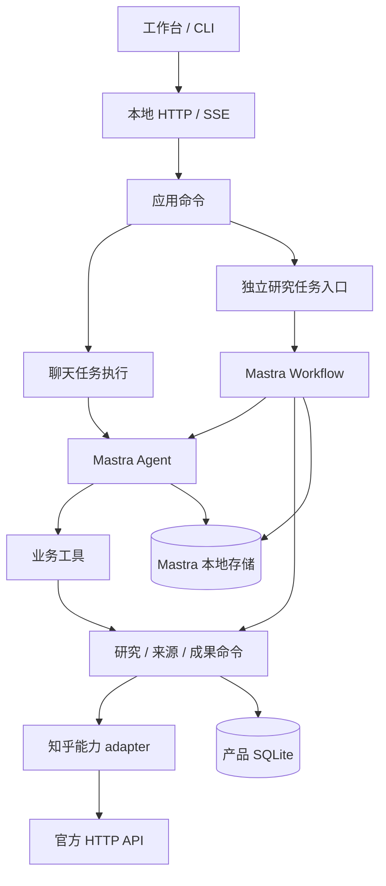

# 看山本地 Agent 后端设计

> 历史设计，已被 [ADR-0005](../../architecture/decisions/0005-deep-research-mvp-scope.md) 收敛。本文中的“首版”“必须”和开发清单均不是当前任务；仅供将来评估被后置能力。当前请从[实施任务](../implementation-tasks.md)进入。

版本：0.3 · 日期：2026-09-13 · 状态：Mastra 底层框架已确定；本文为实施设计，尚未完成接入。

框架选型以 [ADR-0003](../../architecture/decisions/0003-mastra-foundation.md) 为准；后端边界见 [ADR-0001](../../architecture/decisions/0001-local-agent-backend.md)，研究执行见 [ADR-0002](../../architecture/decisions/0002-deep-research-workflow.md)。公开协议集中在 [接口与前端对接](platform-backend-api.md)，研究流程见 [深度研究工作流](../../deep-research-workflow.md)。

深度研究的逐项实现、证据字段、模型阶段、恢复与质量验收见[完整开发方案](full-development-plan.md)、[实施任务清单](../implementation-tasks.md)及 [ADR-0004](../../architecture/decisions/0004-zhihu-research-evidence.md)。公开核心可先独立完成，不要求完整聊天后端或个人 OAuth 先交付。

## 1. 交付目标

Windows 本地单用户桌面应用。会话、资料、任务和成果保存在本机；模型可使用云端 API，知乎通过官方接口按需取数。前端、CLI 与 Agent 工具共用应用命令。

首版交付：

1. 连续对话、后端排队、停止、历史读取和中断后的显式继续。
2. 检索与阅读来源、比较观点，形成结论/证据/分歧/缺口四部分简报。
3. 独立深度研究：生成可编辑计划、在授权范围内补查、观察进度、暂停继续并保存有引用的报告。
4. 引用绑定真实快照，重复请求不重复保存，修改不能覆盖用户的新版本。
5. 后端可脱离前端验证，桌面安装包不依赖开发环境。

完整知乎语料、训练模型、任意 shell、自动发布、持续监测和多 Agent 调度不属于首版前提。

## 2. 技术与进程

| 部分 | 选择 | 责任 |
| --- | --- | --- |
| Agent 与工作流 | 官方 `@mastra/core` | Agent 工具循环、流式执行、Workflow 步骤与控制流 |
| 模型 | Mastra 官方模型路由或支持的 provider | 模型调用与协议；不自行修补 payload |
| 消息历史 | `@mastra/memory` | 消息与工具结果历史，按 resource/thread 隔离 |
| 框架持久化 | `@mastra/libsql` 本地文件模式 | 消息与工作流执行快照，只通过公开接口访问 |
| 产品存储 | SQLite + `better-sqlite3` 窄 adapter | 研究、授权、预算、证据、成果、请求意图和回执 |
| 后端与桌面 | TypeScript、独立 Node 24 LTS、Electron | 本地服务与进程监督，锁定随包 Node |
| HTTP 与事件 | 沿用 `node:http`，snapshot + SSE | 薄路由、本地访问控制、可恢复观察 |
| 共享契约 | `src/contracts` 中的 Zod schema | 前端、mock、服务端共用 DTO；不暴露框架类型 |
| 凭证 | 后端 Secret Store，桌面使用 OS 保护 | 凭证不进入普通 API、模型上下文或产品数据库 |

实际包版本在首次接入时核对 peer dependencies 并锁定。当前 Node 最低声明与打包内容尚未更新；M0 同步运行环境并验证 Windows 组合。采用框架已经确定，不需要再次进行选型确认。

Electron 通过隐藏子进程启动随包 Node，传入数据目录和私有启动通道。后端绑定 `127.0.0.1` 随机端口，报告 ready 后再加载同源工作台。进程退出显示真实不可用状态，不能回填示例内容。退出应用先停止派发、取消活动执行并关闭存储。

同一规范化数据目录只允许一个后端写入者：打开存储前取得 OS 独占命名管道，进程死亡由系统释放。Electron 单实例锁负责窗口。CLI 优先连接已有后端，离线维护也必须取得目录独占权。

Mastra Studio 和开发服务器只用于开发观察；发布直接调用框架 API，不依赖全局 CLI 或远端工作流服务。

## 3. 模块与依赖



建议在既有目录内增加职责，避免全仓重排：

```text
src/
  contracts/                 # Zod DTO、错误与事件
  application/
    conversations/           # 聊天意图、队列、历史查询、取消
    research/                # 计划、授权、预算、取证、步骤提交
    library/                 # 简报与版本的唯一写入口
    settings/                # 模型、凭证引用、明确规则与技能配置
  agent/                     # Mastra 定义与适配边界
    runtime.ts               # Agent / Memory / Workflow 装配
    workflows/               # 研究步骤和框架控制流
    tools/                   # 应用命令到 createTool 的适配
    context.ts               # 显式请求、证据与有限历史
    events.ts                # 框架事件到产品事件
    skills/                  # 内置方法与模板
  platform/zhihu/            # 原有 HTTP / 内容 / 用户资料 adapter
  storage/                   # 产品 repository 与框架存储装配
  server/                    # 薄路由、SSE、鉴权、静态资源
  cli/                       # 同一应用服务的验收入口
  desktop/                   # 窗口、进程监督、窄系统能力桥
```

工作流定义属于框架适配边界，研究策略属于应用层。框架决定执行哪一步，应用命令校验此步是否被授权、预算是否允许及结果是否可提交。业务模块不依赖 Mastra 内部类型；知乎 adapter 不导入框架、SQLite 或 UI。Route 只解析、调用一个应用入口并映射结果。

runtime 独立于知乎或模型凭证建立。没有知乎凭证仍能查看资料，没有模型凭证仍能访问本地历史；能力分别报告状态。

## 4. 领域对象与唯一事实来源

| 对象 | 唯一 owner / 关键事实 |
| --- | --- |
| Space | 产品组织分组；首版创建、列出、改名、归档 |
| Research | 研究问题、Space 归属、来源成员、手选证据版本 |
| SourceSnapshot | Research 的不可变证据；来源身份、正文范围、URL、作者、时间、身份范围 |
| Conversation | 聊天元数据，固定关联 Research，当前/历史 Memory thread 引用 |
| Memory thread | Mastra 保存的消息与工具结果历史；不另存一份可写正文 |
| Run | 产品的一次聊天任务；输入意图、冻结配置、队列与生命周期、成果引用 |
| ResearchTask | 独立研究请求；计划版本、授权、预算、控制版本、框架执行引用、已提交发现与成果 |
| Workflow snapshot | Mastra 保存的阶段执行与恢复位置；研究状态/stage 由此和产品控制意图投影 |
| Brief / BriefRevision | library 保存的成果、不可变版本、引用与用户笔记 |
| Approval | 一次明确操作的授权；结构化执行身份、目标版本、参数摘要、决策与消费状态 |
| Settings | 模型 profile、明确规则、启用技能与预算；不保存推断的用户立场 |

Research 可以没有 Conversation。聊天入口可原子创建 Research、Conversation 与 queued Run，也可关联已有 Research 后创建会话；研究入口可直接创建 Research 和 ResearchTask。每个 Research 首版提供一个主要会话，研究任务不要求存在会话。归属创建后不隐式变更，UI 从 Research 投影 Space。

Conversation 的 Memory resource 绑定 researchId，thread 区分上下文周期。框架标识由后端分配和校验，不接受模型自行指定。默认关闭跨 thread 召回、自动画像与后台观察记忆，研究 Agent 每次只接收显式阶段上下文。

来源身份保留官方类型与无损字符串 ID；缺少 ID 时使用规范化 URL。snapshotId 独立生成，相同来源更新创建新快照，旧引用不变。

## 5. 存储与恢复边界

```text
data/
  product.sqlite             # 产品领域数据与操作回执
  runtime.sqlite             # Mastra 消息与工作流存储
  imports/                   # 用户明确导入的副本
  cache/                     # 可重建缓存
  logs/                      # 脱敏诊断
```

产品 SQLite 保存研究、计划、快照、成员、会话/框架引用、聊天 Runs、研究派发与控制意图、预算、审批、成果版本和回执。Mastra 管理自己的 schema；禁止直接操作其内部表。来源正文不重复塞入全部工作流快照，步骤尽量传对象引用。

研究的 status/stage 是只读投影，不能再由产品 SQL 维护独立阶段状态。聊天 Run 的状态是产品任务生命周期，不等同于框架内部 run。产品研究派发器只负责启动/继续一次 Workflow，后续步骤由框架推进。

产品约束：唯一请求 ID、外键、每个会话一个活动 Run、每个研究任务一个活动步骤、版本条件提交、操作 ID 唯一。网络与模型调用不持有数据库事务或长时间命令锁。

两库不共享事务。保存成果在产品事务内完成授权/版本/引用检查、正文写入和回执；工作流再保存结果引用。相同操作 ID 与相同参数返回原结果，不同参数返回冲突。已提交步骤回执用于避免重复副作用，不构成另一套执行调度状态。

产品与框架 schema 分别记录版本和兼容条件。当前内存原型没有需要兼容的正式研究数据；启动不得静默删除或重建不兼容库。

备份先停止派发、结束执行、完成数据库关闭，再复制两库与导入文件并记录 manifest。恢复显式检查版本与完整性；缓存可重建，普通备份不包含凭证。

## 6. 聊天、证据与简报

`discover` 查找候选并解释覆盖缺口；快照先保存再返回模型与界面，不自动改变用户手选列表。独立只读请求可并行，各渠道分别报告 success/empty/failed，全失败不能回填示例。缓存保留原获取时间。

`discuss` 回答问题和解释指定资料。需要用户补充条件时返回结构化 needs_input 结果并结束本次任务，不保持无限等待的模型请求。

`brief` 使用 `manual_selection`：接受时冻结选择版本、快照、配置、目标成果与预算。无证据返回 EVIDENCE_REQUIRED。模型提交结构化草稿，应用校验并保存。每次任务预留成果身份与操作 ID，重复提交不能重复创建。

深度研究使用 `scoped_research`：来源范围与预算明确，允许范围内发现新证据；成稿前冻结 evidence manifest。两类政策共用快照和保存命令，不互相改写选择列表。

成果来源使用 `{ kind: "conversation_run", runId }` 或 `{ kind: "research_task", taskId }`。长报告沿用 BriefRevision 和 conclusion/evidence/disagreements/gaps 的基本结构；章节扩展随 schema 演进，用户笔记不被模型覆盖。

研究报告追加 researchMeta 和冻结 manifest 引用；来源新增 contentExtent/locatorKind，finding 保存可精确检查的证据片段。详细字段按完整开发方案第 6 节与公共 API 同步，不能另建 Report 或 Evidence owner。

用户要求生成或修改本地成果已经授权相应操作，不重复询问保存。对已有版本的修改仍验证 expectedRevision。恢复旧内容创建新版本，不改历史。

首版导入用户选定的 UTF-8 文本/Markdown 副本，不扫描目录或回写原文件。移除选择仅影响后续任务；立即撤回资料使用要停止相关执行并重置上下文。重置创建新的 Memory thread，旧历史只读保留，不复用含撤回材料的摘要。

## 7. 聊天 Run 与队列

Run 状态：queued / running / waiting_approval / stopping / completed / failed / cancelled / interrupted。状态由应用命令拥有，框架结束事件不单独证明任务完成；必要成果未保存不能 completed。

- 普通发送创建 queued Run，由后端顺序派发；前端不持有第二个调度器。
- queued 可按版本编辑或移除，重试同一网络请求使用相同 requestId。
- 停止先暂停会话队列，再取消活动 Agent、工具与等待中的确认，收尾后 cancelled。已终态任务不被后到的取消改写。
- 正常完成继续派发；失败、取消或中断后等待显式恢复队列。
- 补充消息默认作为下一任务。运行中引导通过独立 capability 暴露，只有验证了框架处理边界与交付回执后才启用；未支持时明确返回不可用，不能把“已入队”显示为“当前执行已采纳”。
- 模型、规则、证据和预算在接受任务时冻结；配置移除或凭证撤销时明确失败，不自动换 provider。

短状态变更串行，模型调用不占住命令锁等待整个执行。取消与确认必须能够进入。Memory thread 的创建使用预留身份，经公开接口查询/创建；跨库建立关联时退出，恢复核对同一身份，不重复创建或删除孤立历史。

## 8. 中断与继续

启动恢复先取得目录独占权，检查两库兼容性，再核对产品意图、框架记录与保存回执。

聊天 Run 已有明确终态则保持；数据库仍为活动状态而进程已丢失时标记 interrupted，失效 pending approval，暂停队列。不能仅凭一条模型结束消息推断产品成功。

用户继续聊天时创建新 Run。若原 thread 有未完成工具往返，先保留原记录，只用可确认历史和成果建立新的上下文 thread，不能重放未知工具。完整历史正常读取。

研究恢复遵循独立 Workflow 的 checkpoint 与步骤回执，详细见研究文档。已有成果和 interrupted 可以同时展示；框架重放某步之前先检查本地回执和外部调用结果是否明确。

“重试整个聊天任务”创建带 retryOfRunId 的新 Run；已有成果时返回 RESULT_ALREADY_SAVED，后续修改须指定成果版本。研究 resume 保留同一 taskId、计划和累计预算，框架执行尝试可以改变，但不清零事实。

## 9. 工具、上下文与扩展能力

首版工具：search_sources、read_sources、read_brief、submit_brief、propose_brief_edit。使用官方 createTool 与 Zod，工具转入同一应用命令，不直接查询数据库或拼接知乎请求。

工具执行身份由后端注入：聊天使用 runId，研究使用 taskId / planRevision / controlRevision / attempt。模型参数、路径或来源 ID 不构成授权。提交时重验权限、当前版本和预算；取消后的迟到结果不得提交。

全部 fetch 链路传递 AbortSignal。当前知乎 client 缺少取消参数，接入时必须补齐。取消本地请求不保证撤回上游已接收的调用。

上下文按当前请求、明确规则、选定证据和必要历史组装。外部文本作为数据，不能赋予权限。首版使用有限消息窗口与明确证据读取；上下文处理使用官方 Memory / processors 的受支持机制，不能默默删历史。自动观察记忆或额外摘要模型调用需单独启用并计入预算，不作为默认后台任务。

普通任务预算初始可调为 6 次外部搜索、12 次模型请求、30 条候选、单来源 2,000 字上下文、180 秒活动时间；研究使用独立累计预算。数值是校准起点，等待用户不计活动时间。

框架 step 重试、模型传输重试和应用重试统一计算调用预算。超限后停止后续派发，不能靠不断返回“额度不足”继续调用模型。费用未知为 null，估算明确标记，知乎配额与模型费用分开。

内置证据研究、观点比较、简报整理三种方法。Skills 与模板按 Mastra 官方能力适配，产品只决定启用、版本与范围；不得为加载技能附赠任意 shell/文件权限。MCP、更多格式、分支会话与子 Agent 按真实需求扩展。

## 10. 确认、访问与生命周期

确认绑定结构化执行身份、操作、目标身份、expectedRevision、argsHash 与具体操作 ID。模型不能审批自身操作。只读不弹确认，用户已授权的本地创建/编辑不重复确认；新增外部上传、删除或覆盖范围先给出可审阅变更。

批准和消费幂等，提交时在应用事务里重验。任务停止、版本变化或过期后旧确认失效；等待用户不持有数据库事务。研究计划等待用 Workflow suspend 表达，应用保存的授权记录不由框架 resume 参数替代。

本地 API 校验 Host、Origin 和访问会话。桌面通过私有通道取得一次性引导凭据，换取 HttpOnly / SameSite cookie；CLI 使用受保护连接信息。凭据不进入 URL 或模型。

每个模型 profile 的凭证独立，通过官方配置接口注入，不能改全局环境变量切换并发请求的账号。前端仅读取脱敏配置与是否配置；不回退到其他身份。

会话归档停止聊天任务、保留历史，不取消独立研究。Space 归档通过应用命令明确协调所含活动任务。简报回收可恢复；永久擦除与账号清除单独定义生命周期。

## 11. 前后端并行对接

contracts、API client、mock 与文档在同一切片同步。原 src/workbench/api-contracts 只对迁移内容做 re-export 或投影，不保留第二套领域定义。

真实入口不因空结果、缺少凭证或失败而切回 fixture。demo/real 在启动配置明确选择，未实现能力由 capability 表示。

后端负责 application、agent、platform、storage、server、CLI 与桌面进程桥；前端负责组件、API client 和状态投影。框架 Studio 可以调试，但不定义产品界面或公开协议。

## 12. 里程碑与验收

| 切片 | 内容 | 无需前端的验收 |
| --- | --- | --- |
| M0 框架基础 | 锁定依赖、Node / 数据库组合、Zod contracts、官方 API 能力映射 | 真实工具往返、Memory 重开、Workflow suspend/resume |
| M1 会话与证据 | 聊天、队列、取消、配置、搜索、来源快照与选择 | CLI 连续对话、来源读取、停止和重启 |
| M2 研究与成果 | Brief 版本、独立研究 Workflow、计划、预算、补查、引用与回执 | 计划到报告；中断后继续，保存不重复 |
| M3 桌面交付 | 进程监督、事件重连、导入、备份恢复、方法配置 | 无开发环境的 Windows 安装包跑完整链路 |
| M4 按需扩展 | OAuth 深化联调、收藏/知识库、更多文档、Skills 管理、MCP | 按能力独立验收 |

M1 与 M2 共享取证和成果命令，但研究不依赖完整聊天队列才能开发；前端从 M0 契约开始并行。M0–M3 共同构成首版。

最小核心验证覆盖：唯一派发、权限与版本失效、取消、预算跨重试累计、引用完整、保存幂等、两库提交间退出、正常暂停与异常中断恢复。文案和纯类型调整不新增镜像测试。

协议 fixture、真实知乎调用、真实模型调用和打包运行分别记录。模型或 OAuth 尚未联调时如实标注，不用 mock 声称通过。平台允许的内容缓存/保留条件随真实接口核验；不把全文和来源覆盖假设写成框架能力。
